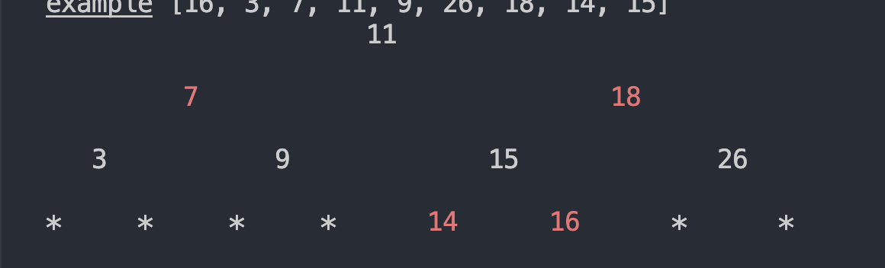

[TOC]

如何介绍算法？使用伪代码？还是每一步都写出来？
# 1、线性表的排序算法
>[python排序代码实现](./python_sort.py)

评价排序算法的标准，除了时间和空间复杂度之外，还有一个就是**稳定**，也就是说如果数组里两个相等的数，那么排序前后这两个相等的数的相对位置保持不变，即为稳定，否则为不稳定。

||是否稳定|时间复杂度|空间复杂度|
|-----|-----|-----|------|
|冒泡排序|稳定|最好的情况$n-1$，最坏的情况$n*(n-1)/2$，所以平均是O($n^{2}$)|O(1)|
|插入排序|稳定|最好的情况$n-1$，最坏的情况$n*(n-1)/2$，所以平均是O($n^{2}$)|O(1)|
|归并排序|稳定|$nlog_2n$|O(n)|
|快速排序|不稳定|最优情况下复杂度是O($nlog_2n$)，最坏的情况是O($n^2$)|O($logn$)|
|希尔排序|不稳定|最坏的情况是O($n^2$)，最优和平均取决于所选的gap数列，以Sedgewick数列为例，最优是O($n^{1.3}$)|O(1)|
|选择排序|不稳定|O($n^2$)|O(1)|
|计数排序|稳定|O($n+k$)，k代表待排序数组中有多少种整数 |O($n+k$)，k代表待排序数组中有多少种整数|
|基数排序|稳定|O($d*n$)，d代表数组中最大值的位数，n代表数组长度|O($r+n$)，r代表基数的数量|
|桶排序|不一定稳定|O($n$)|O($m + n$)，m代表桶的数量|

- [ ] 不同数据规模分别适合使用什么排序模式
- [ ] 排序算法的分类：根据是否稳定，根据时间复杂度的级别：n2、logn、n，根据是否属于比较类型，冒泡排序、插入排序、希尔排序可以归为一类

## 1.1 冒泡排序
冒泡排序的实现是遍历线性表，每次比较两个相邻的元素，如果发现顺序不对，则对换位置；遍历完之后，从头开始，直到顺序ok

**优化**

- 可以记录每次遍历中最后一个进行交换的位置，因为在这个位置之后的顺序都是正确的，下次遍历的时候，到这个位置就可以退出本次遍历
- 其实不用每次都对换两个元素的位置，举例[5, 4, 3, 2]，我们如果用一个变量的值来保存5，每次将4， 3， 2赋给前面一个位置的值，然后将最后一个位置赋值为5就可以

## 1.2 插入排序
插入排序是基于插入操作，将第一个元素作为一个新表，遍历其他元素，判断其他元素在新表中的位置，然后执行插入操作

**优化**  

- 在有序部分插入的时候可以用二分查找定位插入的位置

## 1.3 归并排序
参考：[快速排序和归并排序的时间复杂度分析——通俗易懂](https://www.cnblogs.com/tuyang1129/p/12857821.html)

归并排序是基于分治法的思想，每次将序列拆分两个子序列，每个子序列重复拆分成两个子序列，直到不能在拆分，然后每两个子序列在进行合并，然后返回一个有序的序列

**分析**  
归并为什么更快一些？首先，它使用了一个新的数组，其次，它通过分治法使得每个子序列都是有序的，进而避免来插入操作，每次都是对一个新数组做添加操作

时间复杂度：首先会拆分多少层？$log_2n$层，然后每层合并都会遍历n个元素，所以时间复杂度是$nlog_2n$
空间复杂度：每次递归都会产生一个栈空间，这个大小固定，而每一层会产生一个栈空间，所以总的是O($log_2n$)，另外还需要一个新的数组，O($n$)
> 我第一次思考的时候觉得栈空间的数量肯定不止$log_2n$个，但后来我意识到每次cpu只会沿着一个函数往下执行，而不是立刻生成所有栈空间，所以这里确实是由深度决定的

**优化**
- 判断两个子序列最小值和最大值是否有交集，没有的话可以直接合并
- 对于数组有两个元素的子序列和只有一个元素的子序列，可以使用插入操作实现排序

## 1.4 快速排序

快速排序也是基于分治法，但与归并排序不同的时候，快排并不是随机将序列拆分成两个子序列，而是从序列中选出一个值作为**基准**，然后将小于这个值的元素移动到右边，大于这个值的元素移动到左边，这个操作叫做**分区**。详细步骤如下
1. 从数组中选出基准，保留基准的值`pivot`以及基准的索引坐标`pivot_index`
2. 接受两个游标，如`left`和`right`，一般开始默认为`left`为0，`right`等于数组最后一位的索引坐标，判断`left >= right`，如果为`True`直接退出；同时设置一个移位操作标志`flag`，默认为`false`，如果为`true`，说明出现了移位操作；这里也可以
3. 进入第一层while，退出条件是`left > right`，如果没有退出执行下面的逻辑
4. 进入第二层while，退出条件是`right > pivot_index or data[right] < pivot`，如果没有退出执行`right = right - 1`；如果退出这一层意味着，基准右边出现了一个小于基准的值或者基准右边已经没有小于基准的值了
4. 判断此时基准是否存在一个小于基准的值，判断条件是`if right > pivot_index`，如果为真，执行移位操作，`data[pivot_index] = data[right]; pivot_index = right`，以及修改移位操作标志，`flag = True`
5. 进入第三层while，退出条件是`left > pivot_index or data[left] > pivot`，如果没有退出执行`left =left + 1`；如果退出这一层意味着，基准左边出现了一个大于基准的值或者基准左边已经没有大于基准的值了
6. 类似步骤4，判断此时`left < pivot_index`是否成立，如果成立执行移位操作；第一层while的逻辑至此结束
7. 当退出第一层while后，判断`flag`是否为`True`，若为True，则执行`data[right] = pivot`，这里使用`right`或者`left`都可以，因为到最后`right`必定会等于`left`
8. 重复所有步骤，将`left`置为0，`right`置为`left-1`
9. 再次重复所有步骤，将`left`置为`right+1`，`right`置为`right`

**分析**  
空间复杂度，和归并排序不同，快速排序在每次递归的过程中，只需要开辟O(1)的存储空间来完成交换操作实现直接对数组的修改，又因为递归次数为logn，所以它的整体空间复杂度完全取决于压堆栈的次数，因此它的空间复杂度是O(logn)。

稳定性：不稳定是因为交换的操作

快排相较于归并排序降低了空间复杂度，但是时间复杂度上如果出现最坏的情况，会比归并排序排序更差；但归并排序会频繁地创建和删除数组，所以对于大批量的数据，这些操作也会造成空间和时间效率的降低

**优化**
-  对于快排来说，基准的选择会决定分区的次数，所以选择好的基准可以有效避免最差的情况，这里可以使用随机算法来随机选一个值，也可以很简单的，选择**最左、最右跟中间**三个值的中数作为基准
- 三分区法，对于二分区（把序列分为大于和小于两个分区）来说，不太好处理跟基准刚好相等的值，所以可以将序列分为**大于、小于和等于**三个区
- 小分区（元素数量小于10）使用插入排序


## 1.5 希尔排序
参考：[Shell Sort Algorithm](https://www.programiz.com/dsa/shell-sort)  

>希尔排序是把记录按下标的一定增量分组，对每组使用直接插入排序算法排序；随着增量逐渐减少，每组包含的关键词越来越多，当增量减至1时，整个文件恰被分成一组，算法便终止。

希尔排序就是按照步长从数组中拆分出一个小批量的分片，然后对这个分片做插入排序。具体步骤如下：
1. 首先根据数组的长度选择一个步长(`gap`)，一般默认为数组长度(n)的一半
2. 进入第一层`while`，当`gap > 0`时执行以下逻辑
3. 开始遍历`for index in range(gap, n)`，将`index`存为`current_index`
4. 进入第二层`while current_index >= gap and data[current_index] < data[current_index-gap]`，如果成立，则`data[current_index] = data[current_index-gap]`，然后`current_index = current_index - gap`
4. 退出第二层`while`后，执行`data[current_index] = data[index]`
5. 退出遍历之后，`gap = int(gap / 2)`
6. 退出第一层`while`

**分析**  
希尔排序属于插入排序的优化，一般如果最小值在最后一位，那么需要移动和比较大次数就很多，而希尔排序通过增量跳跃的方式使得那些需要移动很远位置的元素可以跳跃式地快速移动到对应的位置，节省了很多操作。

时间复杂度：不同的gap数列会有不同的时间复杂度，选择比较复杂的数列，可以获得O($n^{1.5}$)的时间复杂度

**优化**  一般的gap的数列可能会导致无用的操作

> 最好的增量序列是 Sedgewick提出的 (1, 5, 19, 41, 109,...)，该序列的项来自 $9 * 4^i - 9 * 2^i + 1$ 和 $4^i - 3 * 2^i + 1$ 这两个算式。

## 1.6 选择排序

选择排序的原理是首先从数组中找到最小或者最大值，然后跟最开始或者最末尾的值交换，接着在除了最开始或者最末尾的数组内找最小或者最大值，然后跟最开始或者最末尾的值交换，以此类推。

**优化**  找到最小值的时候，同时找到最大值，然后将最小值和最大值各自放在对应的位置。

## 1.7 计数排序

计数排序是一种非比较排序，也就是说它不需要像其他排序算法一样会出现值比较大小的场景，计数排序只能对整数排序，首先要获取到待排序数组中的值大小范围，然后创建一个新的数组，每个原数组元素的值对应到新数组的坐标，然后新数组每个元素存放该值在原数组出现的次数。

**分析**  
计数排序特征比较明显，时间复杂度为线性，比所有的比较排序算法都要快；空间复杂度也是线性的，随着数组变大，空间复杂度比其他算法也更大。所以计数排序非常适合**数据范围明确且不大***的**整数**数组

**优化**  暂无

## 1.8 基数排序

基数排序是一种非比较型整数排序算法，其原理是将整数按位数切割成不同的数字，然后按每个位数分别比较

**分析**  
时间复杂度O($d*(n+r)$)，r代表基数的数量 ，一般是0～10的常数，所以约等于O($d*n$)。基数排序有两种类型，一种从高位开始，一种从低位开始，我们目前实现的是低位开始的算法。高位排序看起来很不合理，每个桶内都要再排一次，但有个好处是，当位数降低到一定程度，可以设置对应的最优算法来进行排序。


## 1.9 桶排序

桶排序是计数排序、基数排序的升级版，它设想如果数组可以通过某种映射将数据均匀分布到某些桶内，然后每个桶内再进行单独排序，最后将所有桶中的数据合并起来。

**分析**  
可以看出，基数排序是其中一种桶排序，而它设置的映射规则就是数位。而桶排序的时间复杂度很依赖映射算法，所以它依旧是适用场景比较局限但效率很高的算法。

桶排序不一定是稳定的，因为对于每个桶的排序，可能使用其他非稳定算法来排序，所以桶排序不一定稳定。

todo 4.7 堆排序
todo 4.8 拓扑排序
# 2、栈
## 2.1 代码检查中的括号匹配
- 首先构建一个左右括号的映射关系，例如

```
map = {
  '[': ']',
  '{': '}',
  '(': ')',
}
```
然后构建一个栈

- 接着遍历数组中的所有元素，判断当前元素x是否在map的key或者value中，如果不在，说明x不是括号，可以跳过；
- 如果是的话，需要先判断一下当前栈是否为空，因为空栈执行出栈操作是会报错的，假若是空栈，直接入栈即可；
- 如果非空栈，那么就执行出栈将最近添加的一个元素y取出来。取出之后进行判断，如果y不是任何左括号或者y对应的右括号不等于x时，将y重新入栈，并且将x也入栈
- 最后判断栈是否为空，如果不为空则字符串中的括号不匹配，反之，则匹配。

## 2.2 数学表达式计算
- 中缀表达式转为后缀表达式，需要设置优先级映射关系，入栈前检查当前元素与上个元素的优先级之比
- 入栈出栈运算

## 2.3 函数栈帧
参考：[C函数调用过程原理及函数栈帧分析 ](https://www.cnblogs.com/sddai/p/9762968.html)
参考：[【C语言】深度理解函数的调用（栈帧）](https://blog.csdn.net/alidada_blog/article/details/81911688)

这两篇文章足够帮助理解栈帧的大致轮廓，只要知道栈底指针%ebp和栈顶指针%esp是如何交替的即可，剩余的疑惑是第一文章提到的调用者的“返回地址”，这里不太懂是什么意思，是指被调用者的栈底指针吗？  
返回地址的实际意义是指当函数运行结束后回到上层函数时接下来要执行命令的地址；当主函数调用子函数时压栈的顺序如下：
1. 压入形参
2. 压入返回地址
3. 压入局部变量的存储空间

不知道是不是跟处理器有关，我看到有些地方也写先压入返回地址，再压入形参；具体原理跟c语言在不同处理器上的汇编实现有关系，有时间可以在详细了解下。这里的话知道栈在函数嵌套调用中的作用就可以了。

# 3、二叉树
## 3.1 添加
1. 根据添加值创建新的结点Node
2. 从根节点开始，先左后右，找寻第一个叶子结点为None的结点，然后用Node替换掉

## 3.2 搜索
1. 从根节点开始，先左后右，依次判断当前节点的值是否与输入值一致，如果一致返回结点
## 3.3 删除
1. 根据值找到对应的待删除结点Node，对应的父结点是PNode
2. 判断Node是不是只有左结点或者只有右结点，如果是，将PNode从原来指向Node改为指向左结点或者右结点
3. 如果Node有左右结点，那么首先从Node往下找寻第一个叶子结点，然后将Node的值与叶子结点互换，之后删除叶子结点

> 删除操作只用第三步的方式其实也可以，本来也没什么规范

## 3.4 遍历

相比之下，遍历反而不是很复杂，一般从路径的角度有以下方式，从方向的角度，前三种属于深度优先，第四种属于广度优先
- 前序遍历：根结点->左结点->右结点
- 中序遍历：左结点->根结点->右结点
- 后序遍历：左结点->右结点>根结点-
- 层序遍历：一层一层

实现代码也写在了[AVL树具体实现代码](code/avl.py)

> 递归是很耗费计算机资源的，所以我们在写程序的时候要尽量避免使用递归。幸运的是，绝大部分递归的代码都有相应的迭代版本

这个我倒没有考虑过，说起来使用递归的场合也并没有遇到很多。二叉树遍历的递归实现很简单，但迭代方式却很绕。除了后序遍历之前，其他遍历的迭代方式已经实现，基本应该是没有问题的。<font color=red>后序遍历的迭代实现过于复杂</font>，参考文章一时也想不清楚，以后再说。

# 4、二叉搜索树

## 4.1 添加、搜索

添加和搜索操作  

1. 这两个操作都差不多，把根节点作为当前结点Node开始，判断输入的值跟Node的大小，如果大于Node，就把Node.right作为Node，反之就取Node.left，如果相等就直接返回结点或者将输入值作为新结点插入  

## 4.2 删除
1. 判断被删除结点delete_node.left是否为空，如果不为空，不断找delete_node.left的右结点的右结点，直到某个结点的右结点为None，然后将delete_node的值跟该结点互换，将该结点作为新的delete_node从头开始；
2. 判断被删除结点delete_node.right是否为空，如果不为空，不断找delete_node.right的左结点的左结点，直到某个结点的左结点为None，然后将delete_node的值跟该结点互换，将该结点作为新的delete_node从头开始；
3. 如果delete_node的左右结点都为空，那么直接将delete_node从父结点中移除，并退出

# 5、平衡二叉树

# 6、霍夫曼树
哈夫曼树是基于**贪心算法**的思想，所谓贪心算法就是指在求解某个问题的最优解时，将问题分解成若干个局部问题，然后在每个问题上先确定最优解，从而以此希望最后得到的是整个问题的最优解。  

## 构造

1. 假设我们此刻需要利用一个包含N个值的数组X构造哈夫曼树
2. 首先对X进行排序，取出最小的两个值作为叶子结点，它们之和S作为根结点，生成一颗二叉树
3. 判断当前数组X是否为空，如果为空，返回最后一个根结点；如果不为空，将S放回数组X中
4. 重复步骤2和3

# 7、红黑树

## 添加
相较于平衡二叉树，红黑树多了颜色转换的维度，但核心旋转思路还是跟平衡二叉树的一样，不再重复
1. 首先按照搜索二叉树的插入逻辑，将新的值插入到红黑树中，返回结点X；如果当前红黑树为空，则设置为根结点，颜色为黑，否则为红
2. 判断结点X的父结点Y是否为黑色，如果是，则直接退出，因为黑色下新增红色结点，不影响平衡
3. 如果结点Y为红色，判断下X的叔结点S（也就是Y的兄弟结点）是否为空或者为黑色，如果是，则对X结点、Y结点以及Y结点的父结点Z结点做旋转处理，具体旋转方式参考平衡二叉树的逻辑。简单说一下就是，X结点作为插入结点，Z结点作为不平衡结点。另外需要注意的就是旋转之后，X结点要变为黑色，Y结点和Z结点要变为红色
4. 如果结点Y为红色，同时结点S也是红色，那么将Y和S结点变成黑色，并且将Z结点变成红色，之后将Z结点重复作为新结点，重复上面的步骤即可

## 删除

红黑树的删除算法比较复杂一些
> 我这里似乎表述地很烂。。

1. 首先像普通二叉搜索树一样，在删除时找到一个替换的删除结点，这个替代结点一定是叶子结点
2. 假如替代结点是根结点，那把根结点置为None即可
3. 假如替代结点是红色，那么无需其他操作，因为红色结点对平衡无影响
4. 假如替代结点是黑色，并且兄弟结点为红色，那么父结点必然为黑色，所以首先将兄弟结点改为黑色，然后父结点为红色，然后将兄弟结点朝向替代结点的方向旋转即可
5. 假如替代结点是黑色，并且兄弟结点为黑色，但在跟兄弟结点同一方向上的兄弟的子结点是红色，那么此时不确定父结点的颜色，首先将刚刚提到的子节点置为黑色，然后兄弟结点和父结点的颜色互换，最后将兄弟结点朝向替代结点的方向旋转即可
6. 假如替代结点是黑色，并且兄弟结点为黑色，但在跟兄弟结点相反方向上的兄弟的子结点是红色，那么首先将兄弟结点置为红色，然后子结点置为黑色，将子结点向着兄弟结点的方向旋转，这样子结点就变成了替代结点的兄弟结点，可以重复步骤4
7. 如果不属于上面所有情况，即兄弟结点下面没有一个红色子结点，那么将父结点改为红色，并且作为替代结点，重复上面的步骤

**实现**  

我在实现中想着引入方向的概念可能容易一点，但实际上维护起来也很麻烦；另外我改进了二叉树的展示效果，看起来还可以，但数值的长度还没考虑进去


**比较**  
红黑树实现之后，我个人的感觉是由于红色结点无需特殊处理，使得红黑树相较于平衡二叉树少了很多插入结点的平衡操作，效率有所提升
# 8、B树
## 平衡算法
1. 首先根据插入值的大小判断应该插入到哪个结点，假设判断之后应该插入到A结点
2. 如果A结点的关键字数量小于m-1，那么可以直接把插入值作为一个新的关键字添加进去
3. 如果A结点的关键字数量等于m-1，那么会引起分裂；如果m是奇数，那么取中间的关键字作为分裂点，如果是偶数就在中间两个随便选一个；然后小于分裂点的关键字作为分裂点的左子树，大于分裂点的关键字作为右子树；假设A结点原本存在父结点，那么将分裂点作为关键字添加到父结点中，如果父结点为空，那么将分裂点作为新的父结点；分裂点添加到父结点后，左右子树也会添加到父结点的子树中。然后判断父结点是否会分裂，如果分裂重复该步骤。


## 删除算法

1. 首先还是定位被删除的值在哪个结点，假设删除的值在A结点，删除的值对应关键字B
2. 如果关键字B有左或右子树，那么从左子树中取最大值，或者从右子树中取最小值，替换掉关键字B，然后将被取出的值作为被删除的值，重复判断
3. 那么最后被删除的值此时一定在叶子结点，假设为C结点，那么判断一下结点C在移除这个关键字后剩余关键字的数量X是否满足$X>=[m/2]-1$
4. 假设依旧满足，那么删除就此结束
5. 如果不满足，那么判断一下其相邻的兄弟结点的关键字数量是否满足$X>=[m/2]$，如果满足，被删结点首先跟父结点借一个关键字，然后父结点再从兄弟结点借一个关键字
6. 如果依旧不满足，那么被删结点依旧从父结点取一个关键字，然后跟相邻兄弟结点合并，此时判断父结点是否还符合规则，重复以上操作

# 9、B+树

# 10、图

## 拓扑排序
拓扑排序是指假设图中存在两个结点a和b，如果存在某个路径使得a指向b，那么在拓扑排序中b就会被排在a的后面，只有当图中不存在圈（即两个双向的结点）时才会存在拓扑排序。  

实现拓扑排序的算法并不复杂，首先统计图中每个结点的入度，然后找到入度为0的结点，这些就是拓扑排序的第一层结点，然后将其删除，并重新计算所有剩余结点的入度，重复操作之后，如果图中没有圈则都会删除，并产生拓扑排序的结果。
## 最短路径

- 广度优先算法

1. 设置一个q队列，以及t字典，t存放结点跟结点到输入结点的距离映射关系
2. 输入一个起始结点s，入队；将s结点存入t，设置dis=0
3. 开始while循环，退出条件为队列为空
4. 取出队列中的结点v，遍历它指向的结点c，如果结点c已经存在于t，那就跳过；如果不存在就存入t，并且将dis=t[v] + 1;
5. 最后退出，t中就是输入结点到所有结点的最短路径

> 之后的算法描述建议使用伪代码

- Dijkstra算法

```
for u in V:
		dist[u] = null
dist[s] = 0
H = makequeue(V) // key = dist[]

while H is not empty:
		u = deletemin(H)
		for each edge (u,v) in E:
				if dist[v] > dist[u] + l(u,v):
						dist[v] = dist[u] + l(u,v)
						decreasekey(H,v)
						
// deletemin: 从队列H中取出dist(距离)最小的结点
// decreasekey: 维护最小值
```
# 11、堆
# 12、散列表