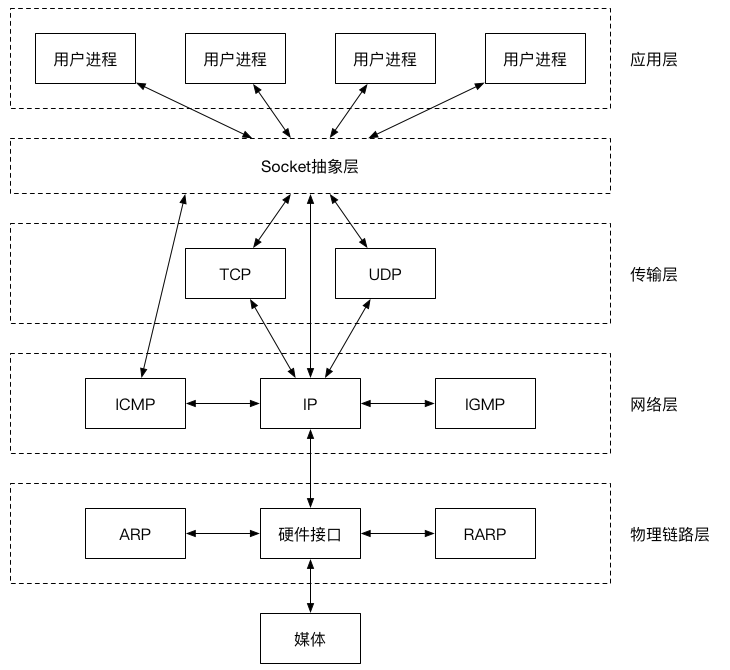
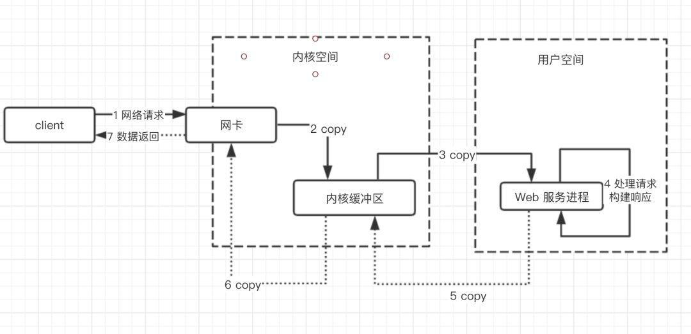

> 之前写了一半，结果被mac的文件夹覆盖“特性”覆盖没了，我很心痛T_T

**要点**

- socket的概念
- socket基本实现
- socket面临的问题-网络io的原因
- 介绍五种网络io模型
- 异步io与协程
- 目前已实现的socket方式
- 整理遇到的问题
- socket具体如何使用，会在哪里用到？

# 一、socket的概念


我们知道通过ip地址、mac地址和arp协议，可以实现计算机之间的定位，然后通过tcp/udp可以实现计算机端口之间的通信。从上图可以看出，所谓socket只不过是对底层的tcp/udp进行了封装，并没有在原有的计算机网络结构上多出什么。之所以需要socket，也许从这个词本身的意思看出来，socket一般指的是插座，当我们将底层协议封装好之后，应用层再去调用时就会方便很多，可以提高开发的效率，这时应用层不再关注传输层的细节，如同电器的插头插到插座就可以得到电力一样，应用层只需要调用socket就可以获取到数据。

# 二、socket基本实现


要使用socket通信，我们至少需要一个客户端和一个服务端，如上图所示，首先初始化服务端，将服务端socket绑定ip和端口，然后开始监听，准备accpet一个连接；另一方面，初始化客户端，然后根据ip和端口向服务端发送connect请求，经过三次握手后建立tcp连接，然后客户端send数据给服务端，服务端recv到数据后开始处理，然后将结果send回客户端，如此反复进行通信，然后由某一方断开连接结束通信。
## 1. 我的实现
关于python中socket实现的代码，以及详细讲解有很多，在这里我只提供一下我的实现代码，仅供参考
- [socket_base.py](code/socket_base.py)
- [socket_server_run.py](code/socket_server_run.py)
- [socket_client_run.py](code/socket_client_run.py)

服务端使用下面的方式即可搭建一个简单的同步阻塞io服务端
```
# 服务端：同步阻塞io
socket_server = ServerSocket()
socket_server.single_run()
```

客户端使用下面的方式可以测试连接
```
# 单个连接，逐次请求
client_socket = ClientSocket()  # block_stats=False
client_socket.single_run()
```
这里我们会发现服务端运行后会一直阻塞在recv这一操作，直到接收到来自客户端的数据，这一步就是网络io模型讨论的关键。
## 2. recv
让我们看下当服务端在recv的时候到底在等待什么



由上图可以看出，服务端首先在等待客户端发送数据，在客户端发送之后，数据包从网卡处到达用户空间之前需要两次copy，在这之前程序一直处于阻塞的状态。

假设我们的服务端需要同时处理很多客户端的请求，应该怎么做呢？如果不修改阻塞的情况，那么使用多线程或者多进程，让多个服务端accpet等待连接并分别阻塞等待数据也是可以的，在连接数不是很大的情况的时候这样还可以满足需求，但假如连接数继续增加，我们会发现创建多线程或者多进程需要的开销会变得很大，而此时大量的程序阻塞在那里，并且有些连接并不活跃，利用率很低，这个时候阻塞就更加浪费了。所以，由此可以看出减少阻塞的影响对于网络io来说很关键，这也就是网络io模型讨论的问题。

#三、网络io模型
## 0、参考
[一文搞懂，网络IO模型](https://zhuanlan.zhihu.com/p/260450151)
[聊聊Linux 五种IO模型-理解io多路复用-select/poll](https://www.jianshu.com/p/486b0965c296)
[5种网络IO模型（有图，很清楚](https://zhuanlan.zhihu.com/p/54580385)
[io-models](https://notes.shichao.io/unp/ch6/#io-models)

关于网络io模型的解释，上面几篇文章已经讲的很详细了，我只谈一下每个部分自己的理解，仅供参考。

## 1、同步阻塞io模型

这个是最基本的socket实现，服务端调用recv后等待数据返回，一直阻塞，阻塞模型中实现多客户端连接的方式就是多线程或者多进程，但每个客户端连接依旧处于阻塞模式

```
# 服务端：多线程阻塞io：处理多连接(与上面不同的是，可以看到服务端并发处理两个请求，打印的内容可以交叉)
socket_server = ServerSocket()
socket_server.multi_run(2) 
```

## 2、非阻塞io模型


非阻塞io模型，每次recv之后会返回一个结果，不论数据有没有准备好都会返回，那么，这跟阻塞模型有什么区别呢？一个是一直在等，另一个是一遍一遍的询问。区别就在于，阻塞模型在阻塞的时候是无法做其他事情，而非阻塞模型，在获取不到数据后可以暂时退出，那么此时程序可以查看是否有新的client进来了，accept新的连接，这样非阻塞的模型就可以与多个客户端建立连接。

```
# 服务端：同步单线程非阻塞io：处理多连接（可以同时启动多个client进行测试）
socket_server = ServerSocket(block_stats=False)
socket_server.single_run_2()
```

**比较多线程/多进程与非阻塞**

虽然两种模式都可以建立多连接，但是通过测试可以看到，多线程/多进程模式中可以并发执行多个客户端的任务，而非阻塞模式是依次处理每个客户端的任务，不会有交叉运行的情况。

## 3、多路复用io模型


在非阻塞io模型中，我们已经可以做到使用单进程/单线程建立多个客户端的连接，但是明显的我们需要去轮询每个客户端连接的数据准备状况，然后再做出后面的处理。其实这样的事情可以不用我们去做，而是调用内核函数select去做，select有三个模式，分别是select、poll、epoll，epoll的优势已经超过了前两者，因而是目前使用最多的。

多用复用io模型是属于事件驱动类型，我的理解是当客户端跟服务端建立连接之后，会在服务端生成一个文件描述符，那么当出现这个文件相关的**读操作**、**写操作**的时候就可以作为事件进行某种触发。这里涉及到文件描述符可以理解为是文件的一种抽象类。

在select模式中，使用的是跟非阻塞io模型类似的线性轮询方式，只不过从用户态的执行切换到了内核态，程序会逐个检查每个连接的文件描述符，看是否触发了读或写的操作，同时它对于轮询的数量也有1024个限制，而poll模式，则不再有数量限制，但区别不大，依旧使用效率不高的轮询方式。但epoll却不是，在运行前，我们会将连接的文件描述符跟事件类型进行了绑定然后注册，当事件触发时主动将对应的文件描述符返回，效率大大提高。

说起多路复用，我理解的意思是指当服务端建立多个连接后，如何让多个连接的io变成一个，也就是让大部分连接阻塞在一个线程上，服务端能够快速获取到数据准备好的连接并进行处理，关键是让所有连接的io最小程度的阻塞整个程序的处理速度。
```
# linux下才能调用select.epoll，使用云服务器测试
socket_server = ServerSocket(block_stats=False, max_conn=100)
socket_server.select_epoll_run(timeout=50)
```

## 4、信号驱动io模型


由上图可以看出，信号驱动的模式跟事件驱动比较类型，都是等文件描述符就绪后反馈给用户进程，然后用户进程再调用这个文件描述符对应的连接做处理。那么有什么区别呢？在io多路复用里面，即使是使用epoll模式，其实还是有阻塞的，只不过我们可以给这个epoll加个时间，例如让eopll阻塞3秒，在3秒内如果有文件描述符做了事件触发，那么就将触发的返回做处理，而信号驱动的是真正没有阻塞，当文件描述符就绪后直接通过信号通道通知用户进程，然后做处理。至于为什么当前tcp连接下使用最多的依旧是io多路复用，而不是信号io，可以参考[三分钟短文快速了解信号驱动式IO，似乎没那么完美](https://www.itzhai.com/articles/it-seems-not-so-perfect-signal-driven-io.html)，总之这个更加适合udp连接，而不是tcp连接。

## 5、异步io模型


异步io模型是当数据完全准备好才会通知用户进程的模式，跟io多路复用的区别在于

>  The main difference between this model and the signal-driven I/O model is that with signal-driven I/O, the kernel tells us when an I/O operation can be initiated, but with asynchronous I/O, the kernel tells us when an I/O operation is complete. 

如果只是看io多路复用的图跟这张图，可能不是很理解到底什么意思。 我还是说下自己的理解，在io多路复用中，当数据完成第一次从copy的时候就通知，而在异步io中当数据完成两次copy才会通知，结合前面给出的recv这一步骤中在等待什么的示意图，就可以这样理解，当数据copy到内核的时候，内核通知用户进程，用户进程调用相应的程序将数据拷贝到用户空间的某个具体的函数栈中做处理，此时处理程序是在用户方的，而在异步io中，当数据copy到内核时，并没有通知用户进程，而是自己调用某个程序将数据copy自己的函数栈进行了处理，只是将处理结果返回给了用户进程，所以说，在异步io中当我们进程第一步询问文件描述符是否准备就绪的时候，就已经将处理函数同时给到了内核，而内核将这个处理函数跟文件描述符进行了绑定，当数据准备好后自动调用执行，然后返回结果。还是那个问题，为什么不使用异步io，而是使用io多路复用呢？虽然异步io是真正的异步，但是有很多因素使得这个方式并不完美，例如以下问题
- 当处理函数调用了很多依赖时，这些依赖也需要导入内核，是否会影响内存？
- 当处理函数比较耗费时间时，内核态的处理是否会挤占其他内核进程？尤其是某些系统相关的关键进程是否会被影响？
- 当处理函数报错时，问题排查和定位方便吗？

以及等等其他问题，可能都使得这个方式不那么完美。其实我也看到一种内存映射的方式，可以不用第二次copy，还没详细了解。

# 四、异步io与协程

在我的socket_server_run代码里，最后还实现了异步io跟协程的配合。
```
# 服务端: select.epoll + 协程asyncio 处理多连接
# linux下才能调用select.epoll，使用云服务器测试
socket_server = ServerSocket(block_stats=False, max_conn=100)
socket_server.async_select_epoll_run(timeout=50)
```

这里只不过是把原来的服务端端消息处理函数由同步函数，改为了异步函数，然后放在协程loop中运行。

# 五、遇到的问题
## 1、ctrl+c中断服务端后，无法立刻重启，提示端口已被占用

解决方法

```
tcp_server_socket = socket.socket(socket.AF_INET, socket.SOCK_STREAM)
tcp_server_socket.setsockopt(socket.SOL_SOCKET, socket.SO_REUSEADDR, 1)
```

## 2、如何判断服务端或者客户端已经断开连接
解决方法
```python
data = client_tcp_socket.recv(self.buffer_size)

# 连接中断
if not data:
    print(f'client no data: {time.strftime("%Y-%m-%d %H:%M:%S", time.localtime())}')
    client_tcp_socket.close()
    self.conn -= 1
    print(f'连接减一，当前连接数{self.conn}')
    break
```

# 六、socket具体会在哪里用到？

了解socket的过程里，我搜索了很多文章，感觉很有趣，也有很多收获。可是随之而来的问题是，作为后端开发者，我的实际工作中并不会使用，甚至接触socket。这次学习让我扩展了视野，但我不仅思考，似有所得之后我又能利用这些做什么呢？

## 1、写一个自己的客户端/服务器
## 2、开始了解上层协议
- http/https协议
- 流媒体协议
