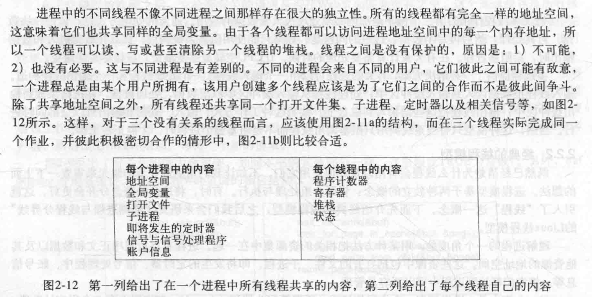
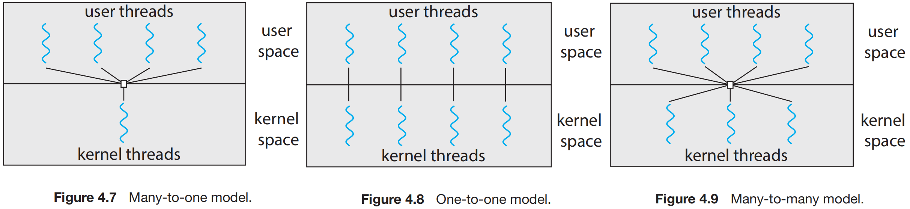
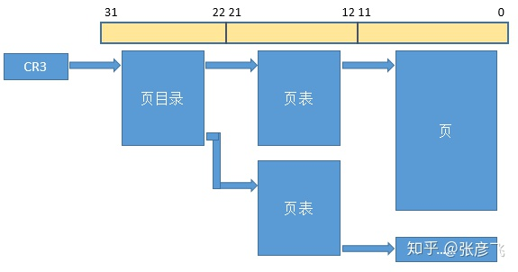
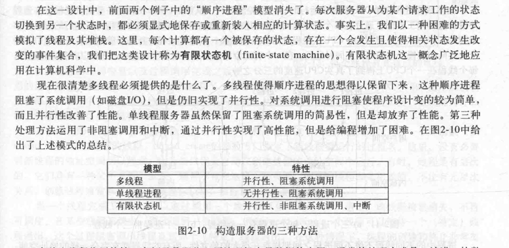

# 序
自从在新公司开始使用python的协程库asyncio后，我开始问自己一个问题，关于进程、线程和协程，我到底想要了解什么呢？在经过一段时间学习后，我似乎理解了一些概念，但又不是很懂，在此做些梳理
# 关键点
- 面试常用回答
- 进程、线程和线程究竟是什么？
- 进程、线程与协程在切换时究竟需要哪些操作？需要多少时间和内存？
- python的协程与go协程的区别
- 父子进程问题(https://blog.51cto.com/002test/2982235)


# 一、面试常用回答
## 1.1 进程
**解释一**：操作系统中程序运行时分配和管理资源的基本单位，分为初始态、执行态、等待态、就绪态、终止态，资源包括各种表格、内存空间、磁盘空间、I/O设备。
**解释二**：进程是一个正在执行程序的实例，包括程序计数器、寄存器和程序变量的当前值

**我的理解**
一段写好的代码是静态的，当我们开始运行这份代码的时候，系统执行中首先分配了**各种资源**，于是产生了进程，即开始执行的程序，它也有了生命周期对应的**状态**，有了在运行结束之前可以独立支配的**资源**，所以说为什么说进程是分配和管理资源的基本单位，因为程序在执行后必然独享一部分计算机资源，以避免跟其他程序冲突。那进程的本质是什么呢？只不过是一个运行中的程序，包括了程序本身的静态代码以及开始执行后系统为其分配的资源，以及可以利用cpu进行逻辑处理的权限。

## 1.2 线程
**解释一**：操作系统中程序运行时系统(CPU)调度的最小单位（内核级线程）

## 1.3 协程
协程：用户级线程，分为有栈协程和无栈协程

## 1.4 关系
进程独享内存空间，线程共享内存空间
多进程运行，进程奔溃不会影响其他进程；线程崩溃，整个进程中止

# 二、进阶理解
参考：《现代操作系统》《Modern Operating System - Tanenbaum.pdf》
## 2.1 进程是什么？
参考：[深度好文|面试官：进程和线程，我只问这19个问题](https://cloud.tencent.com/developer/article/1763620)
> 这篇参考文章的知识同样基本出自《现代操作系统》

目的：了解操作系统中进程具体的存在形式，从细节的角度具体理解进程，并且知道我们可以对进程做哪些操作

解释一：进程的组成包括程序、数据和进程控制块（进程状态信息）
解释二：一个进程就是一个正在执行程序的实例，包括**程序计数器**、**寄存器**和**变量的当前值**
解释三：一个进程是某种类型的活动，它有**程序**，**输入**、**输出**以及**状态**
解释四：进程模型基于两个独立的概念：资源分组处理和执行
解释五：理解进程的一个角度是，用某种方法把相关的资源集中在一起。进程有存放程序正文和数据以及其他资源的地址空间。这些资源中包括打开的文件、子进程、即将发生的定时器、信号处理程序、账号信息等。把它们都放到进程中可以更容易管理。

简单了解以下几个事实
1. 在unix系统中，只有一个系统调用可以用来创建新进程: `fork`
2. 在unix系统中，使用`kill`命令杀死进程，但是却不会影响此进程创建的其他进程
3. 每个进程只有一个父进程，而可以有零个或者多个子进程，在unix中，父进程和所有的子进程组成一个**进程组**
4. 进程的实现方式

> 为了实现进程模型，操作系统维持一张表格（一个结构数组），称为进程表（process table）。每个进程占用一个进程表项。（有些作者称这些进程为进程控制块。）该表项包含了进程状态的重要信息，包括程序计数器、堆栈指针、内存分配状况、所打开文件的状态、账号和调度信息，以及其他在进程由运行态转换到就绪态或阻塞态时必须保存的信息，从而保证该进程随后能再次启动，就像从未被中断过一样。

## 2.2 进程的切换开销
**最重要的参考**：[深入理解Linux内核进程上下文切换](https://cloud.tencent.com/developer/article/1710837)
参考：[进程/线程上下文切换会用掉你多少CPU？](https://zhuanlan.zhihu.com/p/79772089)
参考：[进程切换分析(1)：基本框架](http://www.wowotech.net/process_management/context-switch-arch.html)
参考：[进程切换分析（2）：TLB处理](http://www.wowotech.net/process_management/context-switch-tlb.html)
参考：[进程切换（进程上下文和中断上下文）详解](https://www.huaweicloud.com/articles/12525713.html)
参考：[进程用户态和内核态及其切换过程](https://www.codenong.com/cs106322351/)
参考：
参考：[X86_64 CR3控制寄存器详解](https://www.codenong.com/cs106171361/)
参考：[avoiding TLB flush on process switch](https://www.linuxquestions.org/questions/linux-kernel-70/avoiding-tlb-flush-on-process-switch-656562/)
参考：[Linux内核——进程调度以及进程切换过程](https://www.jianshu.com/p/55a2065ea2aa)

看完操作系统中进程的介绍后，感觉书中只介绍了一部分进程切换时发生的事情。然后我又搜了几篇文章，文章《进程/线程上下文切换会用掉你多少CPU？》提到了以下切换时的开销

>1、切换页表全局目录
>2、切换内核态堆栈
>3、切换硬件上下文（进程恢复前，必须装入寄存器的数据统称为硬件上下文）
>
>- ip(instruction pointer)：指向当前执行指令的下一条指令
>- bp(base pointer): 用于存放执行中的函数对应的栈帧的栈底地址
>- sp(stack poinger): 用于存放执行中的函数对应的栈帧的栈顶地址
>- cr3:页目录基址寄存器，保存页目录表的物理地址
>
>4、刷新TLB
>5、系统调度器的代码执行

文章《X86_64 CR3控制寄存器详解》也提到
> 从本质上说，每个进程切换由两部分组成：
1、切换页全局目录以安装一个新的地址空间
2、切换内核态堆栈和硬件上下文，因为硬件上下文提供了内核执行新进程所需要的所有信息，包括CPU寄存器。

**切入点1：页表**
我在想一个问题，页表真的是在进程切换时刷新的吗？有可能是在进程切换完之后刷新的吗？于是又看了《进程切换分析》这个系列，对于我来说收获很大，但确实很多地方看不懂 T_T

简单说进程切换时确实需要刷新[TLB](# 3.8、页表和TLB)，但是全部刷新必然影响性能，所以这里其实有很多情况，例如不需要全部刷新，内核地址空间就不需要，又比如添加进程id(ASID机制)，使得不用刷新旧进程的信息也可以避免歧义等等不同的刷新方式。但总之，页表和TLB在进程切换时都需要刷新，因为进程独享内存地址空间，切换进程的第一步就是切换内存地址空间。

**切入点2：内核态堆栈与硬件上下文**
根据上面《X86_64 CR3控制寄存器详解》这篇文章提到的切换过程，我想到这样一种情形，当前进程的运行上下文实际上都存在寄存器等硬件中，那么当需要切换当下个进程的时候，首先需要保存这些硬件上下文信息到当前进程的内存中，然后再将下个进程的上下文加载到硬件(寄存器)中，这个加载是不是就是“切换内核态堆栈“的意思呢？

应该不是，内核态堆栈对应的是内核地址空间内的一块内存，而并非一个单独的硬件资源，虽然确实存在ESP寄存器用于存放内核堆栈指针，但是这里的切换也只是更换了指针，并没有影响到上个进程的内核堆栈。既然如此，切换内核态堆栈也应当属于硬件上下文的切换，为什么可以在描述中跟硬件上下文并列呢？

我这些想法在看完《深入理解Linux内核进程上下文切换》之后都差不多理解了，写得真好！
```javascript
__schedule   // kernel/sched/core.c
->context_switch
  ->switch_mm_irqs_off   //进程地址空间切换
  ->switch_to //处理器状态切换
```
>实际上，进程地址空间使用mm_struct结构体来描述，这个结构体被嵌入到进程描述符（我们通常所说的进程控制块PCB）task_struct中，mm_struct结构体将各个vma组织起来进行管理，其中有一个成员pgd至关重要，地址空间切换中最重要的是pgd的设置。

> 其中x19-x28是arm64 架构规定需要调用保存的寄存器，可以看到处理器状态切换的时候将前一个进程（prev）的x19-x28，fp,sp,pc保存到了进程描述符的cpu_contex中，然后将即将执行的进程(next)描述符的cpu_contex的x19-x28，fp,sp,pc恢复到相应寄存器中，而且将next进程的进程描述符task_struct地址存放在sp_el0中，用于通过current找到当前进程，这样就完成了处理器的状态切换。
实际上，处理器状态切换就是将前一个进程的sp,pc等寄存器的值保存到一块内存上，然后将即将执行的进程的sp,pc等寄存器的值从另一块内存中恢复到相应寄存器中，恢复sp完成了进程内核栈的切换，恢复pc完成了指令执行流的切换。其中保存/恢复所用到的那块内存需要被进程所标识，这块内存这就是cpu_contex这个结构的位置（进程切换都是在内核空间完成）。

## 2.3 线程是什么
解释一：在传统的操作系统中，每个进程有一个地址空间和控制线程
解释一：进程拥有一个执行的线程，通常简写为线程
> ?? 这句给我看懵了 0_0，所以找下了原文，把“的”去掉不就好懂了吗？`-__-`
> The other concept a process has is a thread of execution, usually shortened to just thread

解释三：进程用于把资源集中到一起，而线程则是CPU上被调用执行的实体
解释四：线程可以处于若干种状态的任何一个：运行、阻塞、就绪或终止
解释：在线程中有一个程序计数器，用来记录接着要执行那一条命令。线程拥有寄存器，用来保存线程当前的工作变量。线程还用有一个堆栈，用来记录执行历史，其中每一帧保存了一个已调用的但是还没有从中返回的过程



**为什么在有了进程之后还需要多线程**

1. 多个并行实体共享地址空间和所有数据，可以在等待io时互相切换，适用于io密集任务

2. 更容易创建和撤销，适应于大量动态逻辑变动的情形

>2021.10.22：我现在觉得这种理解是不对的，实际上进程概念的创建来源很简单，每个程序有一个实例，这是很容易理解的概念，所以每个程序对应一个进程，而早期计算机只有一个cpu，那么进程自然只能并发运行，所以现在的多进程虽然可以多核并行，但这不是最初预想的；而多线程的出现才是真正为了提升多核性能，因为进程的创建删除开销远大于线程，如果操作系统支持内核线程，那么多线程并行是没有问题的，不像python全局解释锁的局限，其他很多语言都可以做到，所以说多线程的出现是为了并发处理io密集型的任务，这其实是不对的，多线程既适合并发也适合并行，也许是因为我最初是学python开始的，才有之前那些先入为主的想法；至于协程更加适合并发，但完全不支持并行，现在一些语言虽然能够在多核上使用协程，但这个的实现原因实际上是因为多对多的线程模型，本质上并行的仍然是线程，而并发的依旧是协程。

**几个角度**

1. 如果多个逻辑需要对同一个文件做处理，那么多个进程不容易做到，而多线程共享内存，就很容易
2. 假如任务有很多io，切换进程的代价明显高于切换线程(至少省去了切换页表和TLB的代价)，所以提高了CPU的利用率

**几个事实**

1. 在许多系统中，创建一个线程较创建一个进程快**10-100**倍
2. 一些CPU已经有直接硬件支持多线程，并允许线程切换在**纳秒级**完成

虽然某些地方多线程可以并行，但是它最适合的还是**并行**。你看，我们为了保证资源独享，一个程序的资源不受其他程序的影响，所以创造了进程，又为了共享资源，能够并行操作，创造了线程。

**几个操作**

1. `thread_create`：创建新线程，参数中专门指定了新线程要运行的过程名，会返回一个过程标识符，也就是新线程的名字
2. `thread_exit`：线程终止，不再可以调度
3. `thread_join`：一个线程可以等待一个(特定的)线程退出，然后再执行 
4. `thread_yield`：允许线程自动放弃CPU从而让另外一个线程执行(因为线程无法利用时钟中断强制让线程让出CPU)

> 参考: [线程正常终止](https://www.cnblogs.com/zhangxuan/p/6430034.html)

后面发现讲线程的东西比进程多，也复杂一些，再细分一下

### 2.3.1 POSIX线程
>为了实现可移植的线程程序，IEEE标准1003.1中定义了线程的标准，它定义的线程包叫做Pthread。每一个Pthread线程都含有一个标志符，一组寄存器（程序寄存器，状态寄存器，堆栈指针等等），以及一组存储在结构中的属性（包括堆栈大小，调度参数，以及使用线程需要的其它属性）

线程包就是实现线程的一套标准规则
### 2.3.2 在用户空间实现线程

参考：[进程管理、内核级线程、用户级线程](https://www.jianshu.com/p/d4e3bd554ca4)
> 主要看里面提到的用户线程切换中涉及到的寄存器刷新

**几个情况**

1. 内核对于用户线程不可知，对于不支持线程的操作系统来说，同样可以实现线程
2. 每个进程有一个线程表，类似于进程表，记录线程的程序计数器、堆栈指针、寄存器、状态等


当看到这里的`不需要陷入内核`的时候，我不确定这里是指没有进行`程序计数器和寄存器切换`吗？还是指不需要`内核调度`？但我觉得应该是后者，同时参考文章《进程管理、内核级线程、用户级线程》提到了寄存器的切换。
可是我觉得有点奇怪，似乎有个很大的问题，假设用户线程需要去更新PC(程序计数器)和寄存器才能运行，但我们已经知道用户线程不需要内核调度，只需要用户调度，可是更新PC和寄存器难道不是内核级操作吗？用户级线程不应该拥有这样的权限，另外在内核的调度中看不到用户线程，那如果内核有一种调度，用户也有一种调度，那PC和寄存器应该加载哪个调度对应的程序呢？


**用户线程模型**


为了解决上面的问题，我看了一下用户线程的实现方式，似乎理解了一些。但目前因为没看到哪个大佬对于这个问题的回答，所以我只能继续整理一下我自己的理解。如果要回答所谓的用户线程切换到底是如何没有涉及到内核这个问题的，其实很简单，它确实没有更新寄存器和PC，正如在`POSIX线程`中提到的一样，线程内部实现了thread_yield方法来交出CPU使用权，如果用户空间的调度程序可以管理，就可以实现用户线程的切换，整个过程不需要任何内核的操作。接下来，要回答我看到的《进程管理、内核级线程、用户级线程》这篇参考文章为什么会说线程切换的时候会更新寄存器，当然虽然文章没有提到，PC肯定也被更新了，那是因为这篇文章中提到的用户线程是指一对一的线程模型，即一个内核线程对应一个用户线程，而且此时调度程序是内核来做的，这应该是属于支持线程的操作系统，所以切换的时候需要刷新PC和寄存器 。而我上面说的没有涉及到内核操作的，是指一对多的模型，也就是一个内核线程对应多个用户线程，此时调度程序是在用户空间实现的，这是我目前觉得比较对的解释。

### 2.3.3 在内核空间实现线程
在内核实现线程，略微有些不同
1. 进程下不再有线程表，所有内核线程都在一个线程表中，来管理线程的创建和撤销
2. 线程表的线程描述信息与用户线程一样，并且每个线程的信息是所在进程信息的子集（这句比较模糊）
3. 当一个线程阻塞的时候，CPU可以调用进程内其他就绪的线程，也可以调度其他进程中的线程

> 所有能够阻塞线程的调用都以系统调用的形式实现，这里运行时系统过程相比，代价是相当可观的。
运行时系统：用户线程的管理上层

阻塞处理系统阻塞外，例如io操作，还有等待其他线程完成这类的阻塞


## 2.4 线程切换开销
实际上从《深入理解Linux内核进程上下文切换》这篇文章中已经看到了进程切换与线程切换的区别
>内核地址空间切换的时候有一下原则：看的是进程描述符的mm_struct结构，即是成员mm:
1）如果mm为NULL,则表示即将切换的是内核线程，不需要切换地址空间（所有任务共享内核地址空间）。
2）内核线程会借用前一个用户进程的mm，赋值到自己的active_mm（本身的mm为空），进程切换的时候就会比较前一个进程的active_mm和当前进程的mm。
3）如果前一个任务的和即将切换的任务，具有相同的mm成员，也就是共享地址空间的线程则也不需要切换地址空间。
->所有的进程线程之间进行切换都需要切换处理器状态。
->对于普通的用户进程之间进行切换需要切换地址空间。
->同一个线程组中的线程之间切换不需要切换地址空间，因为他们共享相同的地址空间。
-> 内核线程在上下文切换的时候不需要切换地址空间，仅仅是借用上一个进程mm_struct结构。

可惜这篇文章并没有提到用户级线程切换的问题

> 如果机器有一条保存所有寄存器的指令和另一条装入所有寄存器的指令，那么整个线程的切换可以在几条指令内完成。进行类似于这样的线程切换至少比陷入内核要快一个数量级（或许更多），这是使用用户级线程包的极大的优点。

总之，线程切换开销要考虑具体场景，尤其是属于哪种线程模型，内核线程和用户线程是怎样的对应关系，以及线程是否属于同一进程这些。
|我的理解（未得到验证）|需要刷新页表和TLB|需要刷新处理器状态|
|:----:|:----:|:----:|
|不同进程的线程|√|√|
|同一进程的用户线程：一对一模型||√|
|同一进程的用户线程：一对多模型|||
|同一进程的用户线程：多对多模型|-|-|

## 2.5 协程
参考：[从头到尾理解有栈协程实现原理](https://zhuanlan.zhihu.com/p/94018082)
参考：[深入理解Coroutine(协程)及其原理以及Coroutine in Kotlin](https://juejin.cn/post/6844903994003816462)
参考：[初识协程](http://chuquan.me/2021/05/05/getting-to-know-coroutine/)

协程并没有那么容易理解，但是据说其汇编写法只有几十行，所以应该还是可以理解好的。

解释1：(有栈)协程可以理解为一个用户态下的线程，在用户态下进行线程（协程）的上下文切换
解释2：协程是一个计算机组件，用于**非抢占式**的多任务执行，与此同时允许执行的程序可以被挂起和重新恢复

我发现我去看一些关于协程的文章时，其中都不可避免的要提到线程，但是他们提到的线程却似乎跟我之前理解的差别很大，例如
1. 线程是抢占式执行，当发生系统调用或者中断的时候，交由OS调度执行
> 根据POSIX线程的定义，线程包中是存在yield方法的，那么线程必然可以交出执行权的，这里提到的线程反而很像纯内核线程或者是一对一的模型中的用户线程

2. 一个进程可以跑很多个线程处理并发，但是线程进行切换的时候，操作系统会产生中断，线程会切换到相应的内核态，并进行上下文的保存，这个过程不受上层控制，是操作系统进行管理。然而内核态线程会产生性能消耗，因此线程过多，并不一定提升程序执行的效率。正是由于1.线程的调度不能精确控制；2.线程的切换会产生性能消耗。协程出现了。
> 下面提到内核态线程

这两篇文章给我很迷幻的感觉，好像我之前看到的线程更像是协程了，按照他们的说法，似乎只有内核级线程或者一对一的用户线程才算是线程，那想必提到多线程时，他们理解到的就是可以并行的线程，即内核线程。

这也许跟我一直使用的是python有关，python即使使用多线程也只有一个同时执行，所以当我看到相关线程概念的时候，我本能的以为python的多线程就是多个用户线程，但是现在看起来却不一定，python完全可以使用多内核线程来实现多线程，只不过它无法发挥多线程的并行能力，因为全局解释锁，让每个线程只有拿到解释权的时候才能执行。所以什么是协程呢？也许可以称它为用户态线程就可以了。而一般讨论的线程应该指的是内核线程，也就是微进程。

在一对多模型中，每个用户线程真的有必要都存储一份线程信息吗？是不是说每个内核线程在用户空间的线程表中存一份信息就可以，所谓多个用户线程，并不是指在线程表中创建多个线程，因为那样是没有意义的，因为内核线程只有一个，所以用户态的多线程保存的应该是每个用户线程单独的函数栈。

> 自从我开始整理到现在，我意识到自己对这些概念的理解已经到了一个瓶颈，除非我在实际开发中接触这些内容，不然很难进一步确认哪些是对的哪些是错的。所以接下来，我希望是这样安排，整理归纳当前已经理解的概念，然后试图用自己的话叙述一遍，在这个过程中，力图构建相对完整的表达。其次开始学习具体语言中的协程实现，例如python和go，但是这里的学习不是指如何使用，更多的是到底层去看，它是如何实现的，然后有什么区别。

**《初识协程》这篇文章跟我的想法是一样的，也认为协程就是用户线程！**

可真的是这样吗？那么岂不是协程的本质也是符合线程定义的，那跟线程有什么区别呢？

## 2.6 协程实现方式
参考：[有栈协程与无栈协程](https://mthli.xyz/stackful-stackless/)
参考：[协程导引](https://www.jianshu.com/p/0834b825474c)

进程的切换是抢占式的，所以可中断，但线程是非抢占式，理论上如果线程自己不交出执行权，那么是无法中断的；那么内核级线程也是非抢占的吗？这样不就跟优先级为主的操作系统逻辑矛盾吗？

另外一个问题是，我之前特别疑惑的也就是协程（用户级线程，后面只用协程）是如何保存上下文并且等io完成后恢复的。假如说我们现在写一段代码，分为A段，B段和C段，其中A段没有io，而B段开始调用io，C段是io之后逻辑同样不涉及io，那么以python的协程写法为例
```python
async def func():
    A()
    await B()
    C()
```
那么我们猜想一下，await的时候做了什么呢？首先await是我们手动操作的，所以我们已知B段是io操作，那么逻辑上，我们首先异步执行B段的io操作，也就是不等待B段的执行结果，然后保存整个func函数的栈到用户线程表（这个可以叫做协程表吗？），理论上这个表维护着协程的所有信息，然后将执行权交出，由调度程序执行其他就绪的程序，那么当B段io结束之后，如何让func代码进入到准备好的状态呢？之前我们看socket的部分，不论是同步的read还是异步的epoll，都需要执行方主动获取io的状态，那这里的io是如何反馈到主程序的呢？假设存在某个callback逻辑，能够将某个io跟对应的协程绑定，并且存在一个异步获取io状态的线程，当这个io状态更新之后，线程获取到这个状态改变然后调用callback函数扭转对应的协程状态，使得该协程在调度程序中从等待变为就绪的状态，于是调度程序在完成前面的任务后就会重新开始执行这个协程，接着首先从协程表里拿到原来的上下文信息，恢复到内存当中，之后继续执行C段的代码，这样似乎是有点通顺。

> 按照是否开辟相应的调用栈，我们可以将协程分为两类：
> - 有栈协程（Stackful Coroutine）：每个协程都有自己的调用栈，类似于线程的调用栈。
> - 无栈协程（Stackless Coroutine）：协程没有自己的调用栈，挂起点的状态通过状态机或闭包等语法来实现。

> 此处「有栈」和「无栈」的含义不是指协程在运行时是否需要栈，对于大多数语言来说，一个函数调用另一个函数，总是存在调用栈的；而是指协程是否可以在其任意嵌套函数中被挂起，此处的嵌套函数读者可以理解为子函数、匿名函数等

ok，重新梳理一下，每个函数在被执行的时候都有调用栈，该函数内嵌套的函数也在这个调用栈上，而不同层次函数对应不同的栈帧；在有栈协程中，当我们切换协程的时候，就是将当前函数的调用栈，保存到一段内存中，这段内存可以在创建协程的时候申请，当然这里可能内存过大过小的问题，但不同的编程语言有不同的内存分配策略，那么除了函数的调用栈之外，还有寄存器的值，同样也需要保存；而对于无栈协程来说，这些调用栈在切换时会保存到堆中，而恢复到时候，也是从堆中直接取出然后传入。

> 其实python中也有有栈协程的实现，gevent

我比较困惑的地方在于“有栈协程可以在任意嵌套函数位置挂起，而无栈协程不可以”。可能是因为我经常使用的asyncio是无栈协程，但是也可以在任意位置挂起，或者因为我对这两者理解的不深入，所以我很难get到为什么这么说。一样的，我并没有在网上看到仔细回答我这个问题的文章，所以以下还是我个人的理解。我已经通过上面的概念，认知到有栈协程在切换前会将自己当前函数的调用栈以及寄存器值存入到一块独立的内存中，那么接下来如何做呢？我猜这里的下一步是某个地方会将该协程的状态改为等待中，这个状态可以参考线程的状态，其实应该就是一样的，因为协程的本质就是用户级的线程，所以此时协程被挂起，执行权被转移到下个协程，当协程状态改为就绪后，调度程度修改协程状态为运行中，并将调用栈和寄存器值重新加载，并开始执行后续的逻辑。如果只看这个流程，是不是跟函数的位置完全没有关系，因为不论你在最上层的函数挂起，还是最内层的函数挂起，所做的都是一样的上下文保存和恢复操作，并没有什么不同，因为有栈协程确实可以做到这一点。然后我们来看无栈协程，对于无栈协程，首先明确一点，无栈协程并不是没有栈，我看到一个文章说过没有栈，虽然我并没有深入了解过底层，但直觉上每个函数在执行的时候都会有调用栈，我感觉这是不会错的，所以无栈协程的意思是指函数在无栈协程的实现方式中没有保存调用栈。我们已经知道无栈协程是使用状态机或者闭包的形式实现，这两者我也不是特别了解，但具体来讲函数的调用栈和寄存器值应该是保存到了进程的堆里，那么这个怎么实现呢？这部分我的猜想可能不是很准确，我猜当函数切换时，某个地方会将该函数的调用栈和寄存器值返回到上层函数，在上层函数会实现一个逻辑把这些数值存入到跟这个函数有关的堆对象中，那么调度程序再次准备执行该函数的时候，同样会从堆对象中取出数值然后传入上次函数执行的位置，没错，这里我参考的是python的yield和send的方法。那为什么说无栈协程不能在任意位置挂起呢？假设我们的程序主函数是main，然后main中会执行A函数，A函数会执行B函数，那么假设我们想要让B函数遇到阻塞的时候挂起，按照我们上面的猜想，B函数的挂起位置需要将上下文信息返回到上层，而B的上层是A函数，而A函数并非函数的顶层逻辑，这里我暂时不清楚为什么，总之A无法将B返回的信息存入堆中，因此无法实现B的挂起。那么真的无法挂起吗？其实也可以，只要A继续将上下文信息上传，直到顶层逻辑，就可以了，这样一想似乎asyncio中await必须放在async函数中，只有async函数才能调用async函数的逻辑似乎通顺了一点，但依然我无法说服自己为什么A函数不能将数值存入堆中。

> 无栈协程，在创建时，只分配管理协程的对象，并不会去heap/mmap上分配协程的栈空间，无栈协程与主程序共用同一个栈，其布局与普通的函数调用栈一致。很明显，这让无栈协程的内存占用更加小，它不需要预先分配独立的栈空间，只是在suspend时，才在堆上按需分配空间，把主程序栈中需要保存的变量restore起来。但这也带来了更多的限制，无栈协程不能随时进行suspend，必须在协程的top-level函数中才能进行进行suspend操作。（且完全体的无栈协程一般需要编译器原生支持。）

在《协程导引》这篇参考文章中似乎印证了我的观点，但依然我并不清楚suspend的原理。

1、堆与全局变量
2、为什么不能在嵌套函数中将数据存入堆 -----> 例如不能在局部函数中定义全局变量

实际上，python可以在函数内部定义全局变量，如下
```python
globals()[variable] = value
```
不愧是一切皆对象，所以可以做到在内部定义全局变量，而当我们使用```global```的时候，也是到全局对象中找对应的属性。像c这种语言，看似不允许这样做，但假如你在全局创建一个可变的东西，应该也是可以做到的（并没有试过）。那到底是为什么呢？也许只有把python的协完全了解或者把python的堆栈看明白才能了解吧。

这次就先看到这里。

## 2.7 协程切换开销
参考：[async/await异步模型是否优于stackful coroutine模型？ - 朱元的回答 - 知乎](
https://www.zhihu.com/question/65647171/answer/233495694)

与线程和进程的相比较，协程内部其实只有栈空间的切换，io代价极其低廉，而不同的协程实现方式之间(有栈协程和无栈协程)，前者在切换时需要保存上下文以及恢复上下文，后者只需要做堆栈之间的值传递，时间代价上后者更好；前者需要为每个协程函数建立独立的栈来存放上下文以及寄存器值，因为空间代价上后者也更好，我看这个回答中提到易用行，也就是写法上后者更加友好，但我觉得应该不止。
无栈协程的问题还有就是不支持多核，也不支持多线程，而像go的有栈协程，可以使用多核的性能，从这个角度来看有栈协程的性能应该更好一些。

如果具体的语言上，go是静态语言比python的动态语言省去了解释的时间
> 谈到这个，我觉得一直很有意思的是为什么java和go都比python快很多，当然语言的类型是一方面，但我想了解跟多细节。

# 三、名词解析
### 3.1、进程控制块(进程描述符)
> 操作系统为每个进程都维护一个进程控制块(PCB)，用来保存与该进程有关的各种状态信息，PCB是进程存在的唯一标志。PCB包含进程状态的重要信息，包括程序计数器、堆栈指针、内存分配状况、所打开文件的状态、账号和调度信息，以及其它在进程由运行态转换到就绪态或阻塞态时必须保存的信息，从而保证该进程随后能再次启动，就像从未中断过一样。

这里说明进程切换的时候需要对PCB操作

> 进程控制块中存储了什么信息？

> 1、**进程标识信息**
> 如本进程的标识，本进程的父进程标识，用户标识等。
>
> 2、**处理机状态信息保护区**
>
> 用于保存进程的运行现场信息
> - 用户可见寄存器：用户程序可以使用的数据，地址等寄存器
> - 控制和状态寄存器：程序计数器，程序状态字
> - 栈指针：过程调用、系统调用、中断处理和返回时需要用到它

> 3、**进程控制信息**
调度和状态信息：用于操作系统调度进程使用
进程间通信信息：为支持进程间与通信相关的各种标识、信号、信件等，这些信息存在接收方的进程控制块中
存储管理信息：包含有指向本进程映像存储空间的数据结构
进程所用资源：说明由进程打开使用的系统资源，如打开的文件等
有关数据结构连接信息：进程可以连接到一个进程队列中，或连接到相关的其他进程的PCB

### 3.2、中断向量
> 中断向量是指中断服务程序的入口地址。一个进程在执行过程中可能会被中断无数次，但是每次中断后，被中断的进程都要返回到与中断发生前完全相同的状态。

中断发生后操作系统最底层做了什么呢？

1. 硬件压入堆栈程序计数器等
2. 硬件从中断向量装入新的程序计数器
3. 汇编语言过程保存寄存器值
4. 汇编语言过程设置新的堆栈
5. C中断服务例程运行（典型的读和缓冲输入）
6. 调度程序决定下一个将运行的进程
7. C过程返回到汇编代码
8. 汇编语言过程开始运行新的当前进程

### 3.3、程序计数器(Program Counter)
参考：[指令寄存器和程序计数器的区别](https://blog.csdn.net/legend_x/article/details/19619327)
参考：[程序计数器的工作原理](https://www.zhihu.com/question/22609253/answer/21967217)

程序运行开始前，某个东西将程序的内存单元地址放入程序计数器，然后当cpu执行完一条指令之后，会修改程序计数器，使得PC = PC + 1，这个1是cpu刚执行完的指令长度，这样就可以定位到下条指令的位置。

理解程序计数器，这里的程序技术器与最常见的java程序计数器应该是不一样的

### 3.4、寄存器和存储器
参考：[寄存器和存储器之间的差异](https://zh.fondoperlaterra.org/comdifference-between-register-and-memory-34)
用来存放二进制数据或代码的电路称为寄存器，常见的控制和状态寄存器：

- 程序计数器（PC）：记录将要取出的指令的地址，别名 指令指针(instruction pointer)
- 指令寄存器（IR）：记录最近取出的指令
- 程序状态字（PSW：Program Status Word）：记录处理器的运行状态，如条件码、模式、控制位等信息

我看到的很多文章中都会用到这样的说法，例如“进程的寄存器”，“线程的寄存器”，我觉得这里的寄存器指的是，从硬件寄存器中保存的或者需要保存到硬件寄存器上面的二进制数据

具体讲
> 寄存器和存储器之间的基本区别是：寄存器保留CPU当前正在处理的数据，而存储器包含程序执行所需的程序指令和数据。

### 3.5、堆栈
参考：[进程的堆栈空间](https://blog.csdn.net/guoping16/article/details/6579434)
> 栈：程序执行前静态分配的内存空间，栈的大小可在编译时指定，Linux环境下默认为8M。栈段是存放程序执行时局部变量、函数调用信息、中断现场保留信息的空间。程序执行时，CPU堆栈段指针会在栈顶根据执行情况进行上下移动。
>
> 堆：程序执行时，按照程序需要动态分配的内存空间。malloc、calloc、realloc函数分配的空间都在堆上分配

内存是CPU和硬盘之间的通道，数据结构为堆栈。

简陋想法：
进程开始的时候，某个硬件接收到将要执行的程序的地址，然后将这个地址存入到程序计数器里，接下来开始从程序中读取出一个‘逻辑单元’，然后编译为二进制后存入到指令寄存器中，由cpu执行，当cpu执行完毕之后，会去程序计数器中修改地址，指向下一段代码，然后重复读取代码编译执行。

当进程切换的时候，当前使用的寄存器内的信息需要存入堆栈空间(内存)
实际上这部分属于切换**硬件上下文**

### 3.6、写时复制(copy-on-write)
有一种情况，子进程在创建后共享父进程的全部内存，而当子进程或者父进程想要修改某部分内存时，需要首先将内存复制到一个私有内存区域，然后再进行修改，而可写的内存是不可共享的。写时复制主要是为了节省创建进程的内存资源，从而允许操作系统创建大量的进程。

### 3.7、虚拟内存机制

### 3.8、页表和TLB
参考：[操作系统修炼秘籍（11）：分页和页表](https://www.junmajinlong.com/os/mem_paging/)
参考：[TLB缓存是个神马鬼，如何查看TLB miss](https://zhuanlan.zhihu.com/p/79607142)


> 操作系统为每个进程都维护了一个称为页表（page table）的数据结构。页表中的每项代表一个页的映射信息，也称为页表项（Page Table Entry，PTE）。
注意，页表是每个进程都有一个的，因为每个进程的虚拟地址空间都是独立的，各进程中的页映射到物理页自然也是不同的。
每一个页表项中都保存了很多东西，比如最基本的虚拟页号和物理页号、页偏移、页是否有效的有效位（比如表明是否已分配该页内存）、页是否可读/写/执行的保护位、页是存在于内存还是存在于交换分区的存在位、页是否修改过的脏位、页是否最近访问过的访问位，等等。

图中的cr3是一种寄存器，但cr3中可以存放多个进程的页表吗？

页表是一种特殊的数据结构，放在系统空间的页表区，存放逻辑页与物理页帧的对应关系，而TLB是页表的缓存

> TLB(translation lookaside buffer)也有人称为快表
注意：页表是在内存中的，而TLB是在Cache（高速缓存存储器）中的，两者相比从TLB的读取速度更快，目前看到的说法是cpu->寄存器->高速缓存器->主内存

### 3.9、用户态与内核态
CPU拥有一套用于执行的命令集，在用户态时程序只被允许执行整个命令集的一个子集，一般涉及到I/O和内存保护的所有指令是被禁止的，当需要执行这些操作的时候，程序必须进入内核态然后调用操作系统的接口来实现，这些操作也被叫做系统调用

### 3.10、有限状态机
**重要**

### 3.11、栈和栈帧
> 调用栈是一段连续的地址空间，无论是 caller（调用方）还是 callee（被调用方）都位于这段空间之内。而调用栈中一个函数所占用的地址空间我们称之为「栈帧」（stack frame）

### 3.12、时钟中断

# 四、问题
## 4.1、定时器
> 有了这样的抽象，我们才不必考虑中断、定时器和上下文切换

这里的定时器是指什么？

## 4.2、用户线程切换
在一对多模型中，用户线程切换虽然不需要“更新”PC和寄存器，但是肯定需要做设置，这两者之间的区别是什么呢？

# 五、思考
## 5.1、用户级线程切换
**自问**：这里不太懂，只要线程切换，不是应该都需要切换处理器状态吗？为什么这里的说法是可以不切换处理器状态下，只靠用户空间的操作就可以做到线程执行的切换呢？
**自答**：注意这句话`内核对于用户线程不可知`，所以我猜想，这是不是意味着内核已经加载了进程的代码和数据到寄存器中，所以用户线程切换当然可以不需要切换处理器状态，因为整个进程已经加载好了，但感觉这个不算回答。其实早上我在思考这个问题的时候想的是另一个方面，因为前面提到，线程表中其实有线程的程序计数器和堆栈指针，处理器是不是也可以不用从寄存器中获取，而是从内存中获取呢？这样也不需要刷新寄存器。 

但事实上是绝对不可能的
> 通常CPU可以在一个时钟周期内访问一次寄存器，CPU访问内存的速度大概要比访问寄存器慢100倍左右。

不过我似乎有点懂了，所谓用户线程其实不过是逻辑游戏，就好像进程并行让你感觉不到每个时刻只有一个程序在运行一样，多个线程并行时实际上是一样的，通过线程表记录线程状态，然后根据状态分为阻塞、就绪和运行等，进行不同切换，为什么不需要刷新处理器的状态，因为对于内核来说只看得到进程，而线程切换是进程中发生的一个逻辑而已，但是对于我们来说进程其实在做的让线程并发。严格来说，我们所谈的多线程就是指在用户空间中线程的并行问题，其中的调度完全由进程控制，由于此时线程切换不需要进入内核，所以对于内核来说是完全透明的。

到这里就引出了一些比较有趣的话题，例如python是如何在多线程中进程调度的呢？内核线程切换的代价如此大，应该不会有哪种编程语言想要去在内核空间实现，所以python必然也是在用户空间实现多线程的。那它是怎么处理调度的呢？

对于之后要讨论的协程，我大概猜到它是如何实现的了。也许所谓的协程是一个逻辑函数(任务)，每个函数通过堆栈保留着对应的逻辑上下文，也许协程有一个类似线程表的结构，但是绝对要简单很多，我猜也许它只要存储协程的唯一信息以及对应堆栈地址就可以了，当某个任务运行到io的地方就通过yield交出执行权，线程拿到执行权之后交给下个就绪的任务，通过堆栈地址就可以恢复执行这个任务，当然只是猜想。

那么再猜想一下，线程和协程有什么区别呢？从调度逻辑来看，两者都是自己遇到阻塞情况时交出执行权，所以这里没有区别；也许区别就是本身的开销，创建一个线程，就需要在线程表中增加一项，就需要存储程序计数器、寄存器、堆栈和线程状态等，这明显是比协程多的，协程是什么，一个函数而已，只要保留这个函数的一些变量到上下文中，就可以恢复执行，但从内存的角度，两者具体差多少，还需要参考一下别人的文章。

如果上面的猜想成立，那么多线程并行的时候，其实程序计数器和寄存器只是逻辑结构，并没有与实际的硬件交互，也就是说线程切换的时候，对应的程序计数器和寄存器虽然不需要加载到硬件了(这里也是为什么内核不知道用户线程的存在)，但是需要在逻辑上切换。

也许最初的时候，是不是会有人在进程中实现多线程，然后切换每个线程的时候，都让它加载到内核中呢？这样其实已经比切换多进程好了一点，至少不用刷新页表和TLB，但是依旧需要切换程序计数器和寄存器，因为我不是很懂程序计数器的加载，但这里真的可以只加载单个线程的吗？

补充：
1. 也许内核线程切换的代价没有我们想象的那么大，不好说

# 待做
1、服务器模型


2、添加名词跳转
