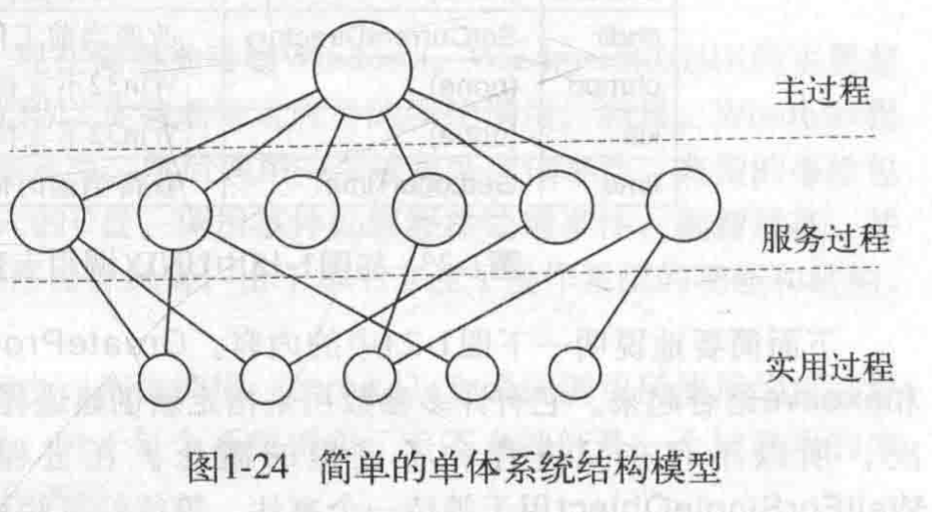
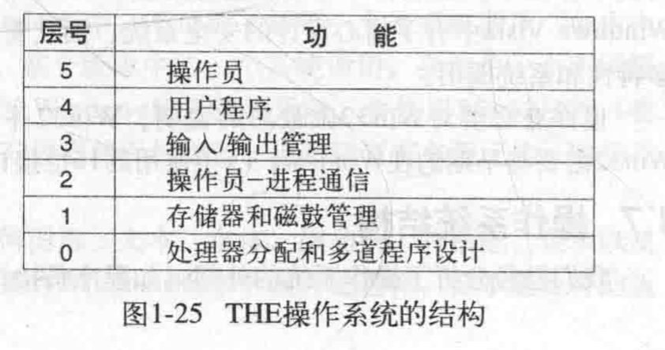
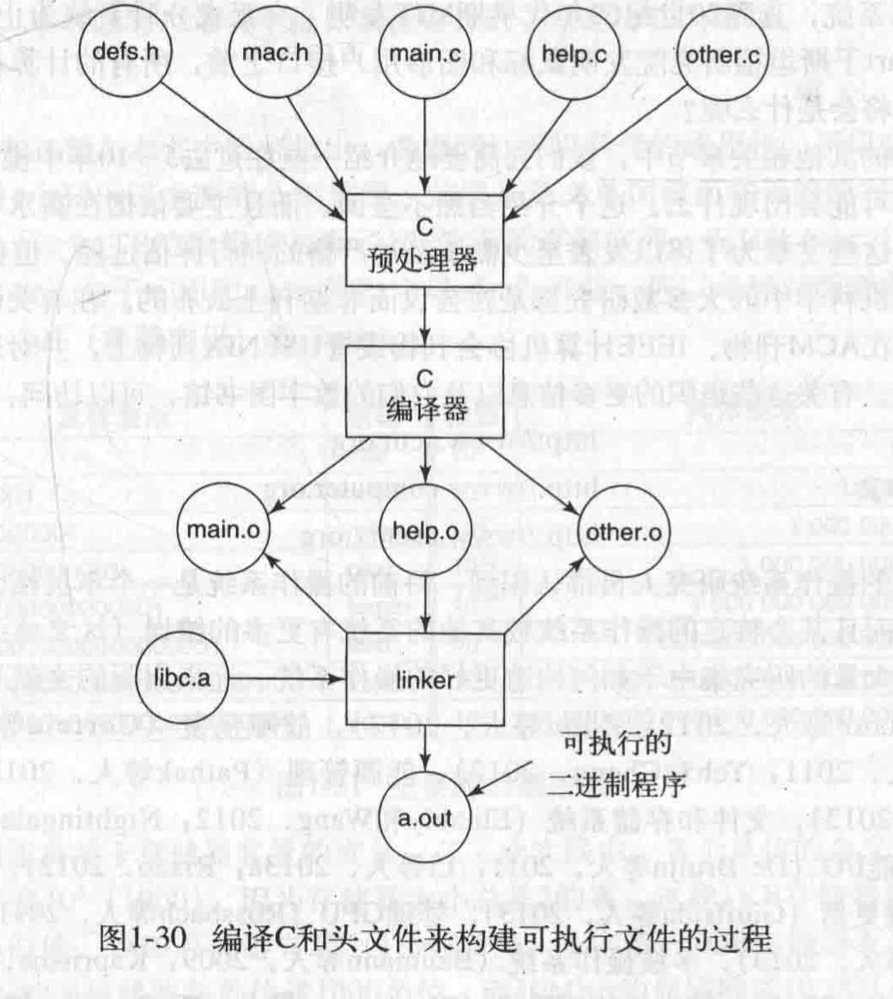

**目的**
- 构建起对操作系统的基础认知，然后回答以下几个问题
	- 什么是操作系统？
	- 学习操作系统需要什么背景知识？
	- 学完操作系统可以做什么？
- 整理操作系统相关的学习路线资料

**待做**
将汇编的部分单独写到语言目录下的一个文件中

**参考**
[macOS上的汇编入门](https://github.com/Evian-Zhang/Assembly-on-macOS)

# 一、哈工大操作系统课程
## 1.1 笔记
参考：[操作系统（哈工大李治军老师）32讲（全）超清](https://www.bilibili.com/medialist/play/watchlater/BV1d4411v7u7)

- 操作系统是计算机应用和硬件之间的软件，用于方便和高效地使用硬件，涉及CPU管理、内存管理、终端管理、磁盘管理、文件管理、网络管理、电源管理、多核管理，重点关注前五个
- 认知操作系统的层次；1）简单调用操作系统的向外接口，2）了解一些内在原理，3）可以编写以及修改操作系统
- 指令计数器与图灵机以及通用图灵机：指令计数器对应通用图灵机中可被设置的控制器
- 开机过程（X86 PC）
1. 根据CS:IP（汇编概念）获取到需要执行代码的位置，CS <<< 4 + IP，cs左移四位加ip
2. 硬件中已经提前预设了rom bios(read-only memory)(basic input ouput system)代码，所在的地址刚好是上面计算出来的地址，所以开始执行bios逻辑
3. 执行bios中的逻辑，一般是检查硬件是否正常
4. 开始读取磁盘0磁道0扇区中的数据到内存0x7c00处，每个扇区512个字节，这个位置是操作系统的引导扇区
5. 修改cs:ip，使得下次计算出来的位置刚好是0x7c00，即让引导区的代码开始执行
- 引导扇区
  汇编代码 boostsect.s

## 1.2 环境搭建
参考：[哈工大李治军操作系统课程实验环境搭建](https://blog.csdn.net/zy010101/article/details/108085192)
参考：[哈工大操作系统课程及实验完结体会以及经验 , 以及开箱即用的虚拟机实验环境](https://juejin.cn/post/6936136067812851742)
参考：[Ubuntu18.04搭建linux0.11实验环境](https://blog.csdn.net/qq_40758751/article/details/88707214)
参考：[哈工大 Linux 0.11 操作系统实验 docker环境 ](https://tech.viewv.top/2020/04/11/%E5%93%88%E5%B7%A5%E5%A4%A7Linux0.11-docker%E5%AE%9E%E9%AA%8C%E7%8E%AF%E5%A2%83.html)
参考：[实现Mac主机上的Docker容器中的图形界面显示](https://www.cnblogs.com/noluye/p/11405358.html)

环境搭建一般使用虚拟机，在mac上推荐使用UTM。因为我个人觉得docker比较方便，所以想用docker试一下，但确实比较麻烦，中间几度想要放弃，但最终好歹可以用了。如果想要使用虚拟机的话，一般将下面Dockerfile中的命令在虚拟机中执行一遍就可以了，虽然我没试过，理论上应该可以。

**docker实现的环境搭建**
首先在docker上搞一个ubuntu的镜像，我用的是18.04版

```
docker pull ubuntu:18.04
```

然后在这个镜像的基础上构建Makerfile，如下。其中gcc-3.4.tar.gz和hit-oslab-linux-20110823.tar.gz链接在[哈工大李治军操作系统课程实验环境搭建](https://blog.csdn.net/zy010101/article/details/108085192)有，我将这两个压缩包下载后放到了一个env目录下

```
FROM ubuntu

COPY env ./env

RUN \
apt-get update \
&& cd ./env \
&& tar -xvf gcc-3.4.tar.gz \
&& tar -xvf hit-oslab-linux-20110823.tar.gz \
&& apt-get install -y binutils \
&& cd ./gcc-3.4/amd64 \
&& dpkg -i *.deb \
&& apt-cache search as86 ld86 \
&& apt install bin86 \
&& apt install -y libc6-dev-i386 \
&& cd ../../oslab/linux-0.11 \
&& apt-get install make \
&& make all \
&& dpkg --add-architecture i386 \
&& apt-get update \
&& apt-get install -y libsm6:i386 \
&& apt-get install -y libx11-6:i386 \
&& apt-get install libxpm4:i386
```
然后构建镜像
```
# os是镜像名称，v1是标签名称
docker build -t os:v1 .
```
但是这样还不行，如果直接在容器中的env/oslab下运行./run，会出现下面的提示
```
========================================================================
                       Bochs x86 Emulator 2.3.7
               Build from CVS snapshot, on June 3, 2008
========================================================================
00000000000i[     ] reading configuration from ./bochs/bochsrc.bxrc
00000000000i[     ] installing x module as the Bochs GUI
00000000000i[     ] using log file ./bochsout.txt
========================================================================
Event type: PANIC
Device: [XGUI ]
Message: bochs: cannot connect to X server 

A PANIC has occurred.  Do you want to:
  cont       - continue execution
  alwayscont - continue execution, and don't ask again.
               This affects only PANIC events from device [XGUI ]
  die        - stop execution now
  abort      - dump core 
  debug      - hand control to gdb
Choose one of the actions above: [die] cont
Segmentation fault
```
这个提示的意思是连接不上显示装置，一般情况下docker的容器无法调用宿主机的显示装置，需要其他工具来实现图形显示。在macos上，需要安装xquartz以及socat
```
brew install socat
brew install xquartz
```
安装好xquartz之后，打开偏好配置，修改安全性中的**允许从网络客户端连接**，然后重启生效。接下来打开socat，运行
```
# 必须在关闭xquartz的情况下启动，否则会提示端口占用，启动socat之后再启动xquartz
socat TCP-LISTEN:6000,reuseaddr,fork UNIX-CLIENT:\"$DISPLAY\"
```
然后执行下列命令获取到mac的ip地址
```
ifconfig | grep -Eo 'inet (addr:)?([0-9]*\.){3}[0-9]*'
# 输出
inet 127.0.0.1
inet 172.19.81.250
```
将ip放到display参数中，启动docker容器
```
docker run -it --privileged -v /tmp/.X11-unix:/tmp/.X11-unix -e DISPLAY=172.19.81.250:0 os:v1 /bin/bash
```
然后进入容器，cd到env/oslab目录下，运行./run，就可以看到界面了
# 二、现代操作系统
参考：《现代操作系统 第四版》

操作系统是位于计算机硬件和计算机应用软件之间的一层，是用于管理计算机硬件资源的软件，同时为应用软件提供系统调用的接口


## 2.1 引论
### 2.1.1 操作系统硬件介绍

一般包括cpu、存储器（寄存器、高速缓存、主存、磁盘）、io设备和总线

***cpu***：

- 用于执行计算机指令，不同的处理器有不同的指令集；
- cpu内部有一些寄存器用于缓存指令和数据，例如指令计数器和堆栈指针等；
- 比寄存器稍远一点的是高速缓存，包括L1缓存、L2缓存和L3缓存，一般位于cpu内部或者非常靠近cpu

***存储器***：

| 名称 | 典型的访问时间 |
| :--: | :--:|
| 寄存器 | 1ns|
| 高速缓存 | 2ns|
| 主存 | 10ns|
| 磁盘 | 10ms|
一般位于cpu内部或者非常靠近cpu

- 寄存器和高速缓存：访问速度极快，一般用于执行时指令和数据的缓存
- 主存：一般是RAM(Random Access Memory，随机访问存储器)，断电时不会保留数据；而ROM(Read Only Memory)不会丢失数据，一般用于存放操作系统的引导加载模块
- 磁盘：存放单位数据的价格最便宜

***io设备***：

​		io设备一般包括设备控制器和设备本身，设备控制器是一块电子芯片，从操作系统接受指令，物理控制设备执行操作；为了跟设备控制器对接，操作系统一般需要该设备的驱动程序。

​		io设备的输入输出有两种方式，一种是busy waiting(忙等待)，也就是轮询，当操作系统把输入传给io设备之后，轮询设备是否完成，直到结束才执行后面的逻辑；另一种就是中断，也就是当设备完成后发送一个中断信号给操作系统

***总线***：
		暂时不看

### 2.1.2 操作系统基本概念

***进程***：
一个进程包括自身的**地址空间**，用来存放程序、数据以及堆栈，还有其他**上下文信息**，一般存放在进程表项之中，例如寄存器、堆栈指针、打开的文件以及其他进程的相关信息。

与进程有关的行为有：创建和终止进程、进程间通信、进程等待另一个进程、通过**警告信号**中断挂起进程、进程的权限管理。

进程的存储空间包括三部分，分别是正文段（例如程序代码），数据段（变量）以及堆栈段
> 这里翻译的不是很好，数据段实际上存放的是程序运行时的全局变量，静态内存分配；而堆栈段才是存放局部变量的地方

***地址空间***：
对于32位或者64位的计算机，地址空间分别是$2^{32}$和$2^{64}$，远大于现在真实的计算机可用主存空间大小，这里主要是操作系统做了限制；假设一个进程需要的地址空间大于当前的主存空间范围，那么一般就需要**虚拟内存**技术来做一个地址空间的映射。

***文件***：
文件系统很熟悉，目录结构也差不多；在程序读取文件时，首先要检查权限，如果允许，就会返回一个小整数，也叫做**文件描述符**，如果不允许，则会返回错误码；这里书中应该讲的是unix中的文件概念，我印象中window没有文件描述符的东西。

另外，在unix中块特殊文件对应磁盘，字特殊文件对应打印机，而**管道**是一种虚文件。

在UNIX中，每个文件都一个唯一编号，叫做**i-编号**，这个编号是**i-节点表格**的引用，表明文件的拥有者和磁盘块的位置。

### 2.1.3 系统调用
关于程序在执行某些操作时必须从用户态进入内核态，这点已经提过了。在POSIX系统中，重要的系统调用一般分为四类，分别是进程管理、文件管理、目录和文件系统管理、杂项。
> POSIX(Portable Operating System Interface of UNIX)，可移植操作系统接口，本质上是一套操作系统的接口定义规范，POSIX定义的接口不一定是系统调用，也可能是用户态的操作。

- folk返回的是子进程的pid，那一个父进程只能创建一个子进程？
- 子进程执行folk返回0，子进程不能创建新的进程？

后面书中介绍了几个系统调用的小例子
- 进程相关的：fork、exec、waitpid
- 文件相关的：open(O_RDONLY、O_WRONLY、O_RDWR、O_CREATE)、read、write、close、lseek、stat
- 目录相关的：mkdir、rmdir、link、mount、unmount
- 其他的：chmod、kill、time

> 目录就是一个（i-编号，ASCII名称）映射的集合

link就是使用源文件的i-编号，在目标目录中添加了新的（i-编号，ASCII名称）映射实现的；很有意思的是，如果源文件和link后的文件都被删除了，unix会发现这个文件存在但没有对应的目录，然后会把它从磁盘移除，这里是因为每个i-编号存放了文件的目录项，所以可以知道目录项为空。这个操作很像python中的自动回收机制。

书中给的例子是`chmod(file, 0644)`，并没有见过这样的权限数字

在win32中，进程没有父子进程的概念，进程之间是平等的。win32主要是事件驱动的。

### 2.1.4 操作系统结构
***单体操作系统***
过程基于过程之上的逻辑


***层次操作系统***
服务基于服务之上的逻辑


***微内核***

模块基于模块之上的逻辑，相对于过程基于过程，如果底层过程报错，那么上层过程，甚至整个操作系统也会崩溃，而基于模块，可以将报错的影响范围限制在模块内，不影响整个操作系统的稳定性。

微内核在实时、工业、航空、军事方面比较流行，因为系统需要更高的稳定性。微内核的代表是MINIX 3。

> 关于微内核的思想以及具体实现，目前了解不是很多，无法具体理解到这类操作系统稳定性好的真正原因。

***客户端和服务器模式***
这个太常见，不说了

***虚拟机***
系统通过一个虚拟机监控程序(virtual machine monitor)，来向用户提供多个虚拟机系统，这些虚拟机精准地复制了**内核态/用户态、i/o功能、中断以及其他真实硬件所应该具有的全部功能**
> 这个是怎么做到的？

当虚拟机中的一个程序执行系统调用的时候，它会首先陷入虚拟机自身操作系统的内核态，然后进入执行对应系统调用，而这些系统调用会由真实的底层操作系统来完成
> 文章中的这部分没怎么看懂

### 2.1.5 c的世界

这部分简单介绍了下c语言，说实话我都快忘记了



## 2.2、进程和线程
关于进程和线程我已经在单独看过一次，这里不再重复记笔记，从通信开始看
### 2.2.1 通信IPC
> IPC((inter process communication)

通信的本质是对共享资源的修改，不可避免地会面对多个对象同时修改的问题
***临界区***
作为解决共享问题的一个基本想法是，假设某个代码片段中会涉及到对共享资源的操作，那么同一时间只能有一个进程可以进入临界区，即执行这个特定的代码片段；如果当某个进程正在执行临界区代码时，第二个进程尝试同样的操作，这时会失败，该进程会挂起直到第一个进程退出临界区。

下面介绍几种解决方案
***屏蔽中断***
disable命令可以让cpu不会因为时钟中断或者其他中断切换到其他进程，所以可以保证在一个进程运行临界区代码时没有其他进程做同样的操作的，但这个命令只能对单个cpu生效，对于多核系统来说，实现的逻辑会很复杂
***锁变量***
锁变量是指设置一个共享变量作为锁，锁会处于开或者关的状态，执行临界区前需要首先读取锁的状态，拿到锁之后将锁设置为关的状态，但这个其实没解决问题，因为两个进程还是有可能同时读到开锁，然后各自执行关锁
> 其实产生这些问题的本质原因是读操作和写操作之间可能发生中断，那么我们就必然面临两个问题
> 1. 如果进程在读之后中断切换到了其他进程，其他进程也开始读，并且各自读到了相同的数据，但要写入不同的数据，就会产生问题
> 2. 假设读写的时候可以保证唯一性，那么如果这个进程在读完之后异常退出了，如何保证其他进程依旧还可以拿到读写的权限

***严格轮换法***
严格轮换法是个很有意思的方法，它的基本思想是给每个进程一个单独的可执行code，每个进程需要进入临界区之前需要先核对下共享变量是否等于自己的可执行code，如果不是，那么要空循环等待；

```c
// 进程一
while (TRUE){
    while (turn != 0);  // 等待允许执行
    critical_region();  // 临界区
    turn = 1;
    noncritical_region();  // 非临界区
}

// 进程二
while (TRUE){
    while (turn != 1);  // 等待允许执行
    critical_region();  // 临界区
    turn = 1;
    noncritical_region();  // 非临界区
}
```
这个虽然可以保证唯一性，但就会出现我提到的第二个问题，假设在临界区程序异常退出了，那么turn永远都不会扭转，其他进程也永远不会被执行

***Peerson解法***
```c
#define FALSE 0
#define TRUE 1
#define N 2  // 进程数量

int turn;
int interested[N];

void enter_region(int process){
    int other;
    other = 1 - process;
    
    interested[process] = TRUE;
    turn = process;
    while (turn == process & interested[other] == TRUE);
}

void leave_region(int process){
    interested[process] = FALSE;
}
```
这个算法的思路是，设置一个turn变量用来表示轮到哪个进程执行临界区的代码，这个变量每个进程都可以修改；然后设置一个数组interested，每个进程在执行临界区代码时同时将自己进程号对应的元素修改为True，表示要执行；每次真正执行前，需要保证这两个变量都符合条件，其实很简单，但可以很好的避免同时修改的问题。

但是这个比较适合两个进程冲突的场景，如果是三个进程，第三个进程修改了turn之后，会让第一个跟第二个进程同时执行，也就是说turn只能卡住最后一个修改的进程，但是会让前面修改的进程都被允许执行，对于多进程冲突的场景还是不适合。

***tsl指令***
tsl是指test and set lock，这是属于硬件级别的锁，目的是避免多处理器之间的冲突问题，原理是进程在读写共享区域之前需要检查锁是否可用，例如为0表示可用，这个指令会将锁的值复制到寄存器，并且修改锁的值为1，然后检查复制出来的锁的值是不是0，不是0的时候需要忙等待重试直到锁成为0，然后进程将锁的值改为1，并进行操作。

> 这个指令对于锁的读和写操作是应该是原子性的

XCHG指令也可以做到，它可以原子性地交换两个位置的内容

***信号量***
信号量是一个整数，用来存放对于累计唤醒次数，正如书中提到的生产者和消费者的例子中**唤醒等待位**一样，信号量实际上是一个进程是否需要阻塞或者允许执行操作的标志。信号量允许两个操作，down和up。

*down*：当一个进程需要执行某些操作前，首先检查信号量的值是否大于0，如果大于0，将信号量减一，然后退出，执行后续操作；如果小于0，进程睡眠，这些对信号量的操作都是原子性的，避免冲突

*up*：例如之前执行临界代码的进程执行结束了，那么就应该将信号量加一，假设此时因为信号量为0正在睡眠的进程有多个，那么此时系统可以按照某种规则选出一个进程来，执行down的操作，此时这些操作也是原子性的，所以即使出现新的进程检查信号量的值，也不会有问题

> 我看到网上有些地方说信号量可以为负值，他们说负值代表等待的进程有多少，也许他们所说的情况是进程在睡眠前就执行了减一的操作，而在up的时候就不再需要减一了。

二元信号量就是信号量初始值为1的情况，即只允许一个进程执行临界区操作。

在书中给的例子，信号量在生产者-消费者模型中的使用，我感觉多个信号量的操作中间存在中断是有可能出现问题的，虽然说这一套可以保证运行，但是，在某一刻读取full和empty加起来的数值也许可能不等于总槽数。

***互斥量***
互斥量相当于简化版的信号量，当我们不需要信号量中的计数功能时，就可以设置一个只有1或0表示加锁或释放锁状态的互斥量。
mutex_lock和mutex_unlock也就是加锁和释放锁的操作，基本原理就是系统TSL指令或者XCHG指令来实现信号量的交换和判断，然后如果可以执行临界区代码就立刻返回结果，如果不行，则忙等待锁被释放。

由于时钟中断，一个进程不会一直忙等待锁的释放，总会切换到其他进程上，比如会释放锁的进程，这样就可以让锁正常释放，当时钟中断再切回忙等待的进程上时就会可以拿到锁，当然这里也可以在释放锁的时候通过某个机制随机选一个等待的进程执行，关键看这里有没有将等待的进程放在队列里进行管理，如果有就可以有机制选择，如果没有就是随机。

在进程中，时钟中断可以切换进程，在线程中，如果一个程序自己不释放执行权就会一直阻塞在忙等待上，但是线程有thread_yield方法可以主动交出执行权，所以其实在线程中比进程更加可控灵活，而且性能更好，因为我们可以设置执行thead_yield的条件，mutex_lock和mutex_unlock也不需要在内核态执行。

其实这里再思考一下，一个线程在执行的时候是自己决定是什么时候交出执行权，我们再回想一下冲突会产生的本质原因就是时间中断导致一个进程读了数据后没有立刻执行，而是切换到另个进程同时读到了这个数据，这样两个进程分别执行后续操作就会出现问题。既然线程不会被时钟中断，理论上自己只要完成读和写的操作后再释放执行权完全没问题，因为没有其他线程可以强行中断，这里的问题是也许线程在读和写中间会有一些io操作，那么此时多线程的情况下，合理的选择是不让整个进程阻塞，而是执行其他线程，这时才会出现另外一个线程读到相同数据的问题。所以线程应该在io操作和thread_yield之前，先把互斥量扭转，这样下个线程就可以通过互斥量判断不能执行，然后再做其他操作就可以了。

***公共地址空间***
对于线程来说，像是信号量等共享变量可以放在进程的公共地址空间中，但是如果对于进程来说，那么有几种方法，一种是内核态系统调用管理的数据结构，例如内核态的信号量，另一种是多数操作系统允许多个进程之间共享一个部分地址空间，还有就是可以使用文件

***futex***
对于锁竞争的问题，存在两种情况，一个是自旋锁，等待者忙等待锁的释放，这种适合激烈不太激烈的场合，因为很多忙等待的进程会导致阻塞；另一个是等待着进入睡眠状态，（我自己叫它待旋锁）等锁释放后再被唤醒，这种适合竞争激烈的场合，但是当竞争不太激烈的时候，频繁切换内核的弊端开始体现。

我刚开始其实并没有很准确地理解到futex做了，甚至我感觉跟待旋锁没有区别，看了一篇文章后才意识到它省去了每次进入内核检查锁状态的消耗，原因是futex在用户态设置了一个锁变量，这样就只有唤醒进程的操作才需要进入内核


# 名词解释
## 多道程序设计(multiprogramming)和分时系统(timesharing)
多道程序设计是从cpu和内存角度实现多程序并发的方案；分时系统是上层实现的多用户同时登录使用同一计算机的操作系统设计，底层使用多道程序实现的
## DMA
专门用于处于io的控制器，分担cpu的压力

# 背景知识
## 1、汇编
### 1.1、段寄存器和指针寄存器
在汇编里通过代码段寄存器以及指令指针寄存器来确定下一段需要的指令，也就是代码首地址以及偏移量，如最常见的CS:IP的偏移规则是CS左移四位然后加IP
之前不太懂pc和ip的区别，看到了一个答案，也就是说ip和pc就是同一个东西

> PC的全称是program counter
> 程序计数器，是用来计数的，指示指令在存储器的存放位置，也就是个地址信息
> 在汇编中用寄存器IP表示pc

**名称对照**

| 简写 | 英文全称 | 中文 |
| :--: | :--:| :--: |
|AH&AL=AX|accumulator|累加寄存器|
|BH&BL=BX|base|基址寄存器|
|CH&CL=CX|count|计数寄存器|
|DH&DL=DX|data|数据寄存器|
|SP|Stack Pointer|堆栈指针寄存器|
|BP|Base Pointer|基址指针寄存器|
|SI|Source Pointer|源变址寄存器|
|DI|Destination Index|目的变址寄存器|
|IP|Instruction Pointer|指令指针寄存器|
|CS|Code Segment|代码段寄存器|
|DS|Data Segment|数据段寄存器|
|SS|Stack Segment|堆栈段寄存器|
|ES|Extra Segment|附加段寄存器|

**对应规则**
IP（Instruction Pointer）：指令指针寄存器，与CS配合使用，可跟踪程序的执行过程； 
SP（Stack Pointer）：堆栈指针，与SS配合使用，可指向目前的堆栈位置。 
BP（Base Pointer）：基址指针寄存器，可用作SS的一个相对基址位置； 
SI（Source Index）：源变址寄存器可用来存放相对于DS段之源变址指针； 
DI（Destination Index）：目的变址寄存器，可用来存放相对于 ES 段之目的变址指针。 

## 2、rep
重复后面一条命令，直到cx为0，一般使用前会设置cx的值，每执行一次，cx减一
## 3、movw
将DS：SI的内容送至ES：DI
## 4、jmpi
jmpi new_ip, new_cs，跳转到新的ip和cs上

# 日志
## 4.1、2021.11.22
这里先使用docker，不行的话，再尝试虚拟机，我这里使用的18.04版本的ubuntu镜像，然后加上env目录下的gcc-3.4.tar.gz和hit-oslab-linux-20110823.tar.gz压缩包
现在有两种可能性，一个是bochs工具包没有安装，另一个是图形显示器的问题，可以尝试启动容器的时候，将显示配置加上；

试了半天还是不行，基本确定是因为docker内无法调用显示器导致的，决定试一下网上可以搞的docker，选中《[哈工大 Linux 0.11 操作系统实验 docker环境 ](https://tech.viewv.top/2020/04/11/%E5%93%88%E5%B7%A5%E5%A4%A7Linux0.11-docker%E5%AE%9E%E9%AA%8C%E7%8E%AF%E5%A2%83.html)》这篇，拉下来之后我直接用镜像开启了一个容器，目录基本跟我的一致，但到了run这一步，直接全部乱码，然后风扇狂转，看样子差点把电脑烧了！这篇文章提到需要搭建x11显示配置，我试了一下，但是感觉一些文章写的巨麻烦，很灰心

不过感觉还是可以试下，所以最后再试一遍

1. 首先下载xquartz
2. 修改配置，允许从客户端连接，重启
3. 在x11的sh中运行docker容器
```
# 这里需要注意在x11的终端中无法输入中文，并且必须在英文输入法下才能输入各种字符，例如小数点
#!/bin/bash

# allow access from localhost
xhost + 127.0.0.1

# run firefox with X11 forwarding and keep running until it quits
docker run -e DISPLAY=host.docker.internal:0 jess/firefox

docker run -ite DISPLAY=host.docker.internal:0 bash
```
后面这个命令没用，然后找了一篇新的文章[宿主机上运行Docker容器gui](https://qiangzibro.com/2021/08/09/%E5%AE%BF%E4%B8%BB%E6%9C%BA%E4%B8%8A%E8%BF%90%E8%A1%8CDocker%E5%AE%B9%E5%99%A8gui/)
关键来了！！！[实现Mac主机上的Docker容器中的图形界面显示](https://www.cnblogs.com/noluye/p/11405358.html)

```
# 配置socat，必须在关闭xquartz的情况下启动
socat TCP-LISTEN:6000,reuseaddr,fork UNIX-CLIENT:\"$DISPLAY\"

docker run -it --privileged -v /tmp/.X11-unix:/tmp/.X11-unix -e DISPLAY=172.19.81.250:0 os:v1 /bin/bash
```


```
docker run -dit -p 50128:22 os:v2
# 1、ssh连不上
# 2、docker run --net=host -v /tmp/.X11-unix:/tmp/.X11-unix -e DISPLAY=unix$DISPLAY -dit os:v2
```

继续尝试ssh
[Macos通过SSH连接显示docker容器的GUI界面](https://www.jianshu.com/p/61031aa66c58)

```
apt-get install openssh-server
# 修改ssh
apt install xorg
```
感觉这个不太对

```
docker run -d -p 2022:22 <Image Name>
```

放弃了，虽然一直可以到了./run这一步，但是里面运行时报的错是缺显示界面，那只能用虚拟机了。
算了，再试试，如果实在不行，再用utm装一个虚拟机

接下来的计划是
1、在docker容器内安装ssh工具，然后做好记录，尽量直接写在makefile里
2、尝试用macos上的ssh连接到docker内，然后运行run命令
3、但是根据我目前的理解，哪怕能够连接ssh，我们也必须下载x11工具，有点想放弃了
